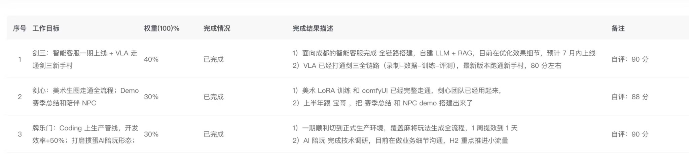

# 对话归档

- 会话 ID：`019f55b8-7217-7cf0-afd5-c5bd9e8247e8`
- 开始时间：2026-07-12 17:46:19 CST
- 原工作目录：`/Users/yuanli/Documents/0711`
- 内容范围：仅保留用户与 Codex 的文字对话及用户附图；不包含平台系统/开发者指令、技能注入、工具调用和工具输出。

## 1. 用户

# Files mentioned by the user:

## ddd48d05a105bc5a26a134211ddefdb5.jpg: /Users/yuanli/Library/Containers/com.tencent.xinWeChat/Data/Documents/xwechat_files/wxid_ia4bby8x9wd121_e9c6/temp/RWTemp/2026-07/ddd48d05a105bc5a26a134211ddefdb5.jpg

## My request for Codex:
产品的职责是：
大的核心业务梳理，
给出顶层产品方案，
用户体验评估标准和把关
跨公司跨团队整体协调，
项目风险控制确保上线

我做了以下几个事情：
策划：
梳理策划核心业务，明确剑心 slg游戏的核心合作场景（智能 npc、玩家赛制总结、武将配对、模拟对战），梳理完成产品方案，并完成 demo 搭建

梳理剑三策划核心流程，梳理核心痛点，对接内部

美术：
深入调研美术场景，完成2d+3d+动作+视频等流程梳理
完成大美术平台设计（资产+马良+comfyui&lora）

coding：
完成玩家生成平台产品方案，跨公司跨团队整体协调，项目风险控制确保上线---基于这些帮我写下 okr，可参考附图

<image name=[Image #1] path="/Users/yuanli/Library/Containers/com.tencent.xinWeChat/Data/Documents/xwechat_files/wxid_ia4bby8x9wd121_e9c6/temp/RWTemp/2026-07/ddd48d05a105bc5a26a134211ddefdb5.jpg">

</image>

## 2. Codex

下面这版按附图的述职/绩效表结构整理，重点突出产品岗位在“业务梳理、顶层设计、体验把关、跨团队协同、风险控制”上的价值，可直接填写：

:::writing{variant="document" id="41826"}
# OKR 完成情况

| 序号 | 工作目标 | 权重 | 完成情况 | 完成结果描述 | 备注 |
|---|---|---:|---|---|---|
| 1 | **策划业务：完成核心业务梳理与 AI 产品方案落地，探索游戏核心合作场景** | 35% | 已完成 | 1. 系统梳理剑心 SLG 核心业务，结合游戏玩法和用户需求，明确智能 NPC、玩家赛制总结、武将配对、模拟对战等重点 AI 合作场景。 2. 完成重点场景的产品方案设计，明确用户流程、产品能力及体验标准，并推动 Demo 搭建，为后续项目立项和正式落地提供验证基础。 3. 梳理剑三策划核心工作流程及关键痛点，识别 AI 可切入的提效环节，完成内部资源和团队对接，推动后续合作方向形成共识。 | 建议自评：90分 |
| 2 | **美术业务：完成游戏大美术 AI 生产链路梳理及平台顶层设计** | 35% | 已完成 | 1. 深入调研游戏美术业务，覆盖 2D、3D、动作及视频等核心生产场景，梳理现有工作流程、角色分工、关键痛点和 AI 能力需求。 2. 从全局视角完成大美术平台产品设计，形成“资产管理＋马良能力＋ComfyUI & LoRA”的一体化平台方案，明确各模块定位、协作关系和整体产品架构。 3. 建立 AI 美术能力的体验评估和质量把关思路，为后续能力接入、资产沉淀及规模化应用奠定产品基础。 | 建议自评：90分 |
| 3 | **Coding 业务：完成玩家生成平台方案设计并推动项目上线** | 30% | 已完成 | 1. 完成玩家生成平台的核心业务梳理和整体产品方案，明确目标用户、核心场景、产品流程及平台能力边界。 2. 牵引跨公司、跨团队协作，统筹业务、产品、研发等相关角色，推动关键事项达成共识并按计划执行。 3. 持续跟进项目进度和交付质量，识别并协调解决项目依赖、资源协同和上线风险，确保项目顺利上线。 4. 对核心用户链路及生成体验进行评估和把关，保障产品方案与最终交付效果符合预期。 | 建议自评：92分 |

# 总体目标总结

围绕游戏策划、美术生产和玩家生成三类核心业务，完成从业务调研、痛点识别、顶层产品设计、Demo 验证到跨团队协同及上线交付的完整产品闭环。通过统一梳理 AI 在游戏研发与玩家体验中的应用场景，初步形成覆盖“策划内容生产—美术资产生产—玩家内容生成”的产品布局，为后续 AI 能力平台化和规模化落地奠定基础。
:::

## 3. 用户

# Response annotations:
Each item contains text selected from an earlier Codex response and may include a user comment. Use every selection as context and address every comment in your response.
<response-annotations>
[{"text":"OKR 完成情况序号工作目标权重完成情况完成结果描述备注1策划业务：完成核心业务梳理与 AI 产品方案落地，探索游戏核心合作场景35%已完成1. 系统梳理剑心 SLG 核心业务，结合游戏玩法和用户需求，明确智能 NPC、玩家赛制总结、武将配对、模拟对战等重点 AI 合作场景。2. 完成重点场景的产品方案设计，明确用户流程、产品能力及体验标准，并推动 Demo 搭建，为后续项目立项和正式落地提供验证基础。3. 梳理剑三策划核心工作流程及关键痛点，识别 AI 可切入的提效环节，完成内部资源和团队对接，推动后续合作方向形成共识。建议自评：90分2美术业务：完成游戏大美术 AI 生产链路梳理及平台顶层设计35%已完成1. 深入调研游戏美术业务，覆盖 2D、3D、动作及视频等核心生产场景，梳理现有工作流程、角色分工、关键痛点和 AI 能力需求。2. 从全局视角完成大美术平台产品设计，形成“资产管理＋马良能力＋ComfyUI & LoRA”的一体化平台方案，明确各模块定位、协作关系和整体产品架构。3. 建立 AI 美术能力的体验评估和质量把关思路，为后续能力接入、资产沉淀及规模化应用奠定产品基础。建议自评：90分3Coding 业务：完成玩家生成平台方案设计并推动项目上线30%已完成1. 完成玩家生成平台的核心业务梳理和整体产品方案，明确目标用户、核心场景、产品流程及平台能力边界。2. 牵引跨公司、跨团队协作，统筹业务、产品、研发等相关角色，推动关键事项达成共识并按计划执行。3. 持续跟进项目进度和交付质量，识别并协调解决项目依赖、资源协同和上线风险，确保项目顺利上线。4. 对核心用户链路及生成体验进行评估和把关，保障产品方案与最终交付效果符合预期。建议自评：92分"}]
</response-annotations>

## My request for Codex:
帮我生成一份excel文档

## 4. Codex

我会使用表格制作能力，把这份 OKR 整理成可直接提交的 Excel，并检查排版、换行和权重汇总。

## 5. Codex

我会保留附图的“目标—权重—完成情况—结果描述—备注”结构，同时加入自动计算的权重合计和综合自评分，方便后续直接修改。

## 6. Codex

已生成 Excel，包含完整 OKR、权重合计、加权综合自评分（90.6 分）及总体总结。

[下载：游戏AI产品_OKR完成情况.xlsx](/Users/yuanli/Documents/0711/outputs/okr_excel/游戏AI产品_OKR完成情况.xlsx)
