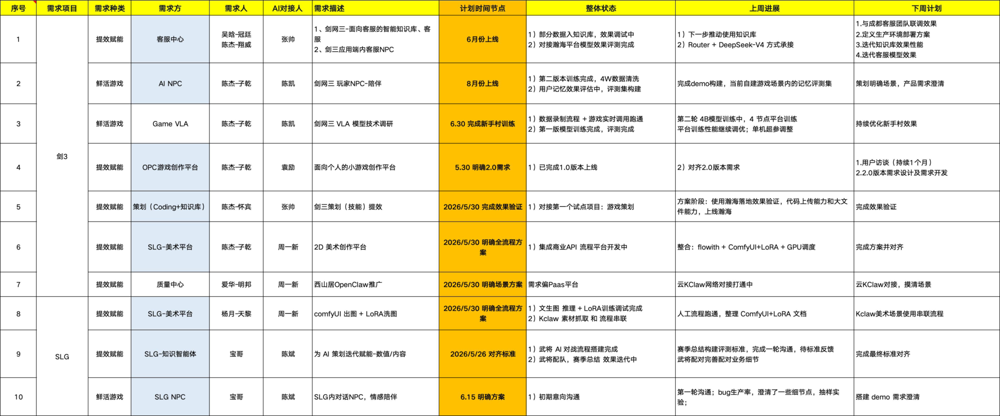
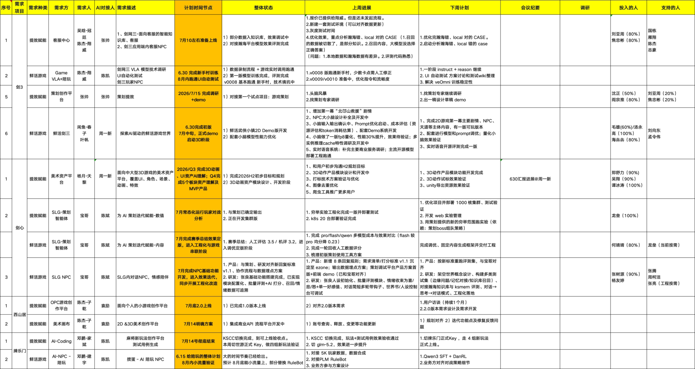

# 对话归档

- 会话 ID：`019f55d4-bfdb-74c1-8434-601852e63dcd`
- 开始时间：2026-07-12 18:17:13 CST
- 原工作目录：`/Users/yuanli/Documents/0711`
- 内容范围：仅保留用户与 Codex 的文字对话及用户附图；不包含平台系统/开发者指令、技能注入、工具调用和工具输出。

## 1. 用户

# Files mentioned by the user:

## 461c5bcc004833ecd853d04412f30e40.png: /Users/yuanli/Library/Containers/com.tencent.xinWeChat/Data/Documents/xwechat_files/wxid_ia4bby8x9wd121_e9c6/temp/RWTemp/2026-07/9e20f478899dc29eb19741386f9343c8/461c5bcc004833ecd853d04412f30e40.png

## b8849b5245dad084e7326172a204b911.png: /Users/yuanli/Library/Containers/com.tencent.xinWeChat/Data/Documents/xwechat_files/wxid_ia4bby8x9wd121_e9c6/temp/RWTemp/2026-07/b8849b5245dad084e7326172a204b911.png

## My request for Codex:
帮我基于附图2的内容，及附图1的格式，形成630的周报内容

<image name=[Image #1] path="/Users/yuanli/Library/Containers/com.tencent.xinWeChat/Data/Documents/xwechat_files/wxid_ia4bby8x9wd121_e9c6/temp/RWTemp/2026-07/9e20f478899dc29eb19741386f9343c8/461c5bcc004833ecd853d04412f30e40.png">

</image>

<image name=[Image #2] path="/Users/yuanli/Library/Containers/com.tencent.xinWeChat/Data/Documents/xwechat_files/wxid_ia4bby8x9wd121_e9c6/temp/RWTemp/2026-07/b8849b5245dad084e7326172a204b911.png">

</image>

## 2. Codex

已根据附图2的信息，按照附图1的字段格式整理为“6·30周报”内容。附图2中的“会议纪要、调研、投入的人、支持的人”等附加字段未纳入主表。

:::writing{variant="document" id="63001"}
# AI项目6·30周报

| 序号 | 需求项目 | 需求种类 | 需求方 | 需求人 | AI对接人 | 需求描述 | 计划时间节点 | 整体状态 | 上周进展 | 下周计划 |
|---|---|---|---|---|---|---|---|---|---|---|
| 1 | 剑3 | 提效赋能 | 客服中心 | 吴晗-冠廷、陈杰-翔威 | 张帅 | 1. 剑网三面向客服的智能知识库、客服；2. 剑三应用端内客服NPC | 7月10日左右准备上线 | 1. 部分数据入知识库，效果调试中；2. 对接瀚海平台模型效果评测完成 | 1. 报价已提供给翔威，尚未发起流程；2. 新建一套测试环境，可对齐数据更新；3. 灰度测试时间待定；4. 持续优化瀚海、Local对应CASE，重点解决知识召回及模型选择问题 | 1. 优化瀚海、Local对应CASE；2. 启动并分析瀚海、Local错例CASE |
| 2 | 剑3 | 鲜活游戏 | Game VLA＋陪玩 | 陈杰-翔威 | 陈凯 | 剑网三VLA模型技术调研、UI自动化测试、剑三玩家NPC | 6月30日完成新手村训练；8月内跑通UI自动测试 | 1. 数据录制流程及游戏实时调用已跑通；2. 第一版模型训练及评测完成；3. V0008基础跑新手村，技术填坑中 | 1. V0008版跑通新手村，少数卡点需人工修正；2. V0009/V0010准备中，持续优化指令和流程 | 1. 第一阶段Instruction＋Reason继续；2. 梳理UI自动测试方案并补充测试Wiki；3. 解决VeOmni训练稳定性问题 |
| 3 | 剑3 | 提效赋能 | 策划创作平台 | 张帅 | 张帅 | 策划提效 | 7月15日完成调研＋Demo | 已对接第一个试点项目：游戏策划 | 1. 完成头脑风暴；2. 开展找策划专家调研 | 1. 持续开展策划专家调研；2. 输出一稿设计草稿Demo |
| 4 | 剑3 | 鲜活游戏 | 鲜活剑三 | 闲鱼-春子、叶帆 | 周一新 | 探索AI驱动的鲜活游戏世界 | 6月30日完成初版；7月中旬正式Demo启动3D阶段 | 1. 鲜活武侠小镇2D Demo版本开发；2. 配套小脑模型性能优化 | 1. 新增第一幕“北邙山救援”剧情；2. NPC大小脑设计及全链路开发；3. 小脑输入输出确认，启动Prompt优化及成本评估；4. 配套Demos系统开发；5. 小脑完成一版FP8量化，推理性能提升约30%；6. 实时语音系统完成初步调研并跑通主流开源模型部署工程 | 1. 完成2D游戏第一幕主要剧情、NPC及天道等主体内容，形成一版可玩版本；2. 配套进行模型和Prompt调优，量化小脑效果验证；3. 完成一版实时语音开源方案评测 |
| 5 | 剑心 | 提效赋能 | 美术资产平台 | 杨月-天黎 | 周一新 | 面向中大型3D游戏的美术资产平台，覆盖山、角色、场景、动画、特效 | 2026年Q3完成3D动画、UI资产AI理解；Q4完成5个板块资产理解及MVP产品 | 1. 完成2026年H2初步目标和规划；2. 3D动画资产模块设计、开发阶段 | 1. 与用户初步沟通H2规划目标；2. 3D动作产品模块设计和开发中；3. 打标技术方案验证与优化；4. 图像去重优化；5. 爬虫工具推广至更多用户 | 1. 完成3D动作产品模块功能开发；2. 开展3D动作技术方案验证；3. 完成Unity导出资源效果验证 |
| 6 | 剑心 | 提效赋能 | SLG-策划智能体 | 宝哥 | 陈斌 | 为AI策划迭代赋能——数值 | 7月常态化运行玩家对战分析 | 1. 与策划已确定输出；2. 正在开发集群版 | 1. 完成穷举实验工程化第一版并部署测试；2. 完成K8s 20台部署验证 | 1. 优化项目并部署1000核集群，开展测试验证；2. 开发Web实验管理；3. 使用策划提供的新穷举范围开展实验 |
| 7 | 剑心 | 鲜活游戏 | SLG-策划智能体 | 宝哥 | 陈斌 | 为AI策划迭代赋能——内容 | 7月完成赛季总结效果定版，进入工程化与游戏串联阶段 | 1. 赛季总结：人工评估3.5分、机评3.2分，进入调优定版阶段；2. 调优定版阶段 | 1. 完成Pro、Flash、Qwen多模型成本与效果对比；2. 完成一轮回收人工数据评分；3. 梳理初版策划使用工具方案 | 完成调优，固定内容生成框架并交付工程 |
| 8 | 剑心 | 鲜活游戏 | SLG NPC | 宝哥 | 陈斌 | SLG内对话NPC、情感陪伴 | 7月完成NPC基础功能开发，进入效果迭代，并同步开展工程化改造 | 1. 产品：与策划、研发对齐新回复标准V1.1及协作流程、数据埋点方案；2. 研发：张良基础功能完成，已实现模板配置化、批量评测、AI打分及召回与情绪接口追溯 | 1. 产品：新增8条回复规则，需求清单及打分标准V1.1沉淀至Ezone；输出数据埋点方案；策划测试平台产品方案首版及前端Demo已完成对齐；2. 研发：张良人设初始化、批量评测、情绪收束为喜悲怒轻等功能进入联合调试 | 1. 产品：按新标准重跑评测，与宝哥对齐；2. 研发：架空世界概念设计、构建多类测试集，并对接瀚海知识库及评测能力，推动工程化落地 |
| 9 | 西山居 | 提效赋能 | OPC游戏创作平台 | 陈杰-子乾 | 袁励 | 面向个人的小游戏创作平台 | 7月底2.0上线 | 已完成1.0版本上线 | 对齐2.0版本需求 | 1. 持续开展用户访谈；2. 完成2.0版本需求设计及开发 |
| 10 | 西山居 | 提效赋能 | 美术画布 | 陈杰-子乾 | 袁励 | 2D、3D美术创作平台 | 7月14日明确方案 | 集成商业API，流程平台开发中 | 完成账号查询、释放、变更等功能更新 | 1. 规划并对齐2.0迭代功能点；2. 修复反馈问题 |
| 11 | 牌乐门 | 提效赋能 | AI-Coding | 邓鹏-寰斌 | 陈凯 | 麻将新玩法创作平台测试用例生成 | 7月14日专项底结束 | KSCC切换完成，已上线验收点；本周功能游正式Key，并完成做四组新玩法验证 | 1. KSCC切换完成，玩法及测试用例效果验收通过；2. 切换GLM-5.2，效果进一步提升 | 完成切牌乐门正式Key；走完4组新玩法正式上线流程 |
| 12 | 牌乐门 | 鲜活游戏 | AI-NPC陪玩 | 邓鹏-建宇 | 陈凯 | 掼蛋AI陪玩NPC | 6月15日给晓玩的整体计划；8月内完成小流量验证 | 大致时间节奏已经给出；预计8月底完成小流量验证，部分替换RuleBot | 1. 对接约5K玩家数据，完成数据合成；2. 对接PLM RuleBot；3. 完成业务方参与方案设计 | 1. 推进Qwen3 SFT＋DanRL；2. 与业务方对齐策略细节 |
:::

## 3. 用户

帮我放在excel中

## 4. Codex

我会把刚才整理的12条周报写入Excel，并按附图1设置黄色表头、橙色时间节点、分组及自动换行。我先按表格技能的流程生成并检查文件。

## 5. Codex

我已确认字段和排版规则。接下来会生成一个“6·30周报”工作表，并进行一次内容检查和整表预览，确保长文本没有明显截断。

## 6. Codex

Excel正在生成并渲染预览；由于内容较多，预览处理稍慢。我会在完成后再检查表头、颜色和长文本显示。

## 7. Codex

已生成Excel，包含12条“6·30周报”内容，并按附图1完成表头、时间节点颜色、换行及冻结窗格设置。

[AI项目630周报.xlsx](/Users/yuanli/Documents/0711/outputs/019f55d4-bfdb-74c1-8434-601852e63dcd/AI项目630周报.xlsx)
