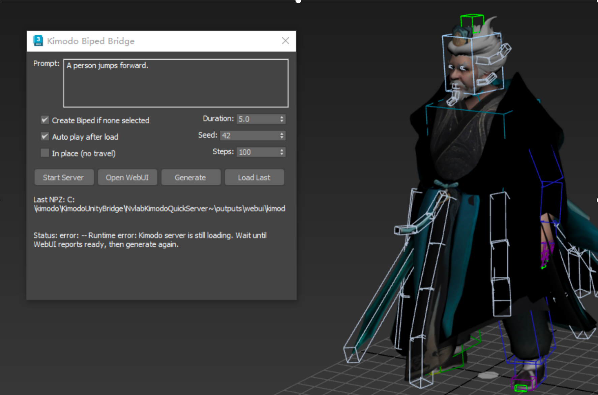

# 对话归档

- 会话 ID：`019f5bb3-f2da-7e43-8fa8-8cc46db39b9e`
- 开始时间：2026-07-13 21:39:07 CST
- 原工作目录：`/Users/yuanli/Documents/0711`
- 内容范围：仅保留用户与 Codex 的文字对话及用户附图；不包含平台系统/开发者指令、技能注入、工具调用和工具输出。

## 1. 用户

# Files mentioned by the user:

## 58da62ce10afe8c4f9860c265ac91e9b.png: /Users/yuanli/Library/Containers/com.tencent.xinWeChat/Data/Documents/xwechat_files/wxid_ia4bby8x9wd121_e9c6/temp/RWTemp/2026-07/9e20f478899dc29eb19741386f9343c8/58da62ce10afe8c4f9860c265ac91e9b.png

## My request for Codex:
帮我解读这张图

<image name=[Image #1] path="/Users/yuanli/Library/Containers/com.tencent.xinWeChat/Data/Documents/xwechat_files/wxid_ia4bby8x9wd121_e9c6/temp/RWTemp/2026-07/9e20f478899dc29eb19741386f9343c8/58da62ce10afe8c4f9860c265ac91e9b.png">



</image>

## 2. Codex

这张图展示的是一个在 **Autodesk 3ds Max 中用文字生成角色动作**的工作流。

左侧是 **Kimodo Biped Bridge** 插件面板，右侧是已经绑定骨骼的角色模型。当前输入的指令是：

> “A person jumps forward.”（一个人向前跳）

主要参数含义：

- `Duration: 5.0`：目标动画时长 5 秒。
- `Seed: 42`：随机种子；保持不变通常可复现相近结果。
- `Steps: 100`：生成迭代步数，通常步数越多耗时越长。
- `Create Biped if none selected`：未选择骨骼时自动创建 Biped。
- `Auto play after load`：加载生成结果后自动播放。
- `In place (no travel)` 未勾选：允许角色产生实际位移，符合“向前跳”；勾选后则会原地做跳跃动作。
- `Start Server`：启动本地动作生成服务。
- `Open WebUI`：打开生成服务的网页界面。
- `Generate`：根据提示词生成动作。
- `Load Last`：加载最近一次生成的动画文件。

图中真正的问题在底部状态栏：

> `Runtime error: Kimodo server is still loading. Wait until WebUI reports ready, then generate again.`

意思是：**Kimodo 后端服务还没有完成加载，用户过早点击了 Generate，因此本次生成失败。** 这不是角色模型或骨骼绑定报错。

正确操作顺序应是：

1. 点击 `Start Server`。
2. 点击 `Open WebUI`。
3. 等网页显示服务或模型已经 `Ready`。
4. 回到 3ds Max，再点击 `Generate`。
5. 生成完成后，插件会读取下方 `Last NPZ` 路径中的动作文件，并加载到 Biped 骨骼。

右侧彩色线框和方框是角色的骨骼控制器及绑定结构，不是模型破损。整体来看，这是一个把自然语言转换成动作数据，再将动作重定向到 3ds Max Biped 角色上的插件界面。

## 3. 用户

这是一个把自然语言转换成动作数据--结合截图具体说说

## 4. Codex

结合截图来看，这套流程可以理解为：**你用一句话描述动作，Kimodo 生成骨骼运动数据，再由 3ds Max 插件把它套到角色的 Biped 骨骼上。**

截图中的具体数据流是：

```text
“A person jumps forward.”
          ↓
Kimodo 本地生成服务
          ↓
生成约 5 秒的动作数据（NPZ 文件）
          ↓
Kimodo Biped Bridge 读取动作
          ↓
映射到右侧角色的 Biped 骨骼
          ↓
角色执行“向前跳”
```

具体对应关系如下：

1. **自然语言输入**

   左侧 `Prompt` 中填写的是：

   > A person jumps forward.

   它描述的是动作意图，而不是传统动画软件中的具体参数。用户不用逐帧设置髋部高度、膝盖弯曲和脚部位置，只需说明“一个人向前跳”。

2. **动作生成**

   点击 `Generate` 后，插件会把提示词以及这些参数发送给 Kimodo 服务：

   - `Duration: 5.0`：生成约5秒的动作。
   - `Seed: 42`：控制随机结果；相同设置下便于复现。
   - `Steps: 100`：生成计算的迭代步数。

   Kimodo 会把“向前跳”解释为一段随时间变化的人体姿态，例如：

   - 起跳前屈膝、压低重心；
   - 双腿蹬地；
   - 身体腾空并向前移动；
   - 双脚落地；
   - 屈膝缓冲并恢复站姿。

   最终生成的并不是角色外观，而是各个骨骼在连续时间点上的位置、旋转等运动数据。

3. **保存动作文件**

   面板里的 `Last NPZ` 显示了最近生成结果的位置。由此可以判断，Kimodo 服务会先把动作保存成 `.npz` 数据文件。

   这类文件通常包含一系列动画帧，以及每帧的人体关节或骨骼姿态。截图不能确认其内部字段，但可以确定它是生成服务与 3ds Max 插件之间传递动作的中间文件。

4. **映射到角色骨骼**

   右侧角色周围的彩色框线就是 Biped 骨骼或控制器：

   - 头部方框控制头和颈部；
   - 胸腹区域控制脊柱和骨盆；
   - 手臂线框控制上臂、前臂和手；
   - 腿部线框控制大腿、小腿和脚。

   `Kimodo Biped Bridge` 的作用，就是把生成文件中的人体运动转换成这些 Biped 控制器的关键帧。角色模型本身只是跟随骨骼发生变形。

5. **是否产生向前位移**

   截图中 `In place (no travel)` 没有勾选，所以动作不仅会呈现跳跃姿势，角色的根节点或骨盆还会向前移动。

   如果勾选它，则通常会保留身体的跳跃动作，但消除整体向前位移，角色看起来会在原地完成动作。这种“原地动作”更适合交给游戏引擎单独控制角色移动。

6. **当前为什么没有生成成功**

   底部提示：

   > Kimodo server is still loading.

   说明自然语言还没有真正完成转换。Kimodo 的模型服务仍在启动，插件此时无法取得动作数据。需要等待 WebUI 显示 `Ready` 后再次点击 `Generate`。

所以，这张截图展示的核心并不是“AI直接操控角色模型”，而是：

**文字描述 → AI生成人体骨骼运动 → 保存为NPZ → 插件转换成Biped关键帧 → 已绑定的角色跟随骨骼运动。**
