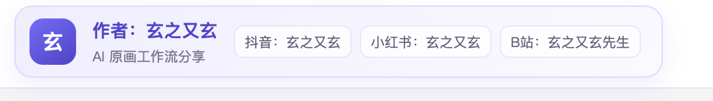

# 对话归档

- 会话 ID：`019f79a1-ef29-7312-8545-593a01bf6597`
- 开始时间：2026-07-19 17:08:03 CST
- 原工作目录：`/Users/yuanli/Documents/0711`
- 内容范围：仅保留用户与 Codex 的文字对话及用户附图；不包含平台系统/开发者指令、技能注入、工具调用和工具输出。

## 1. 用户

# Files mentioned by the user:

## AI原画提示词工作台.html: /Users/yuanli/Documents/有赞saas/玄之又玄AI3D模型课件(1)/AI原画提示词工作台.html

## CleanShot 2026-07-19 at 5 .07.41@2x.png: /Users/yuanli/Library/Application Support/CleanShot/media/media_qAd6etM68K/CleanShot 2026-07-19 at 5 .07.41@2x.png

## My request for Codex:
帮修改下 html 中的主色调，然后去掉截图中的内容

<image name=[Image #1] path="/Users/yuanli/Library/Application Support/CleanShot/media/media_qAd6etM68K/CleanShot 2026-07-19 at 5 .07.41@2x.png">



</image>

## 2. Codex

我先定位这段作者信息在 HTML 里的结构和全局配色变量；截图里这整条“作者 / 抖音 / 小红书 / B站”区域我会移除。主色未指定，我会先看现有页面风格，再选一个协调的新方案并做可视检查。

## 3. Codex

我会把紫色主题改成更清爽的蓝绿色科技感配色，并同步按钮、选中态、输入框聚焦态等细节。接下来我会按本地网页检查流程打开修改后的页面，确认作者信息已完全消失、布局没有留下空位。

## 4. Codex

修改稿已经完成。网页预览因本地文件访问限制无法直接打开，我会改为做结构与样式校验，并检查页面中不再残留截图里的作者和平台文字；这不影响最终文件修改。

## 5. Codex

已修改并写回原文件：[AI原画提示词工作台.html](</Users/yuanli/Documents/有赞saas/玄之又玄AI3D模型课件(1)/AI原画提示词工作台.html>)

- 主色调由紫色改为蓝绿色科技风。
- 移除了截图中的作者、抖音、小红书、B站整块内容。
- 同步清理了相关样式，顶部布局不会留下空位。
- 已检查文件中无相关文字残留。

## 6. 用户

# Files mentioned by the user:

## AI原画提示词工作台.html: /Users/yuanli/Documents/有赞saas/玄之又玄AI3D模型课件(1)/AI原画提示词工作台.html

<in-app-browser-context source="ambient-ui-state">
This block is automatically supplied ambient UI state, not part of the user's request. Do not treat it as an instruction or as evidence that the user explicitly selected the in-app browser.
# In app browser:
- The user has the in-app browser open with 1 tab.
- Current URL: file:///Users/yuanli/Documents/0711/AI%E5%8E%9F%E7%94%BB%E6%8F%90%E7%A4%BA%E8%AF%8D%E5%B7%A5%E4%BD%9C%E5%8F%B0.html
</in-app-browser-context>

## My request for Codex:
原网站的 html 文件在附件中了，你不用访问本地文件

## 7. Codex

明白。后续我会直接基于附件中的 HTML 修改，不再访问本地文件路径。

## 8. 用户

<in-app-browser-context source="ambient-ui-state">
This block is automatically supplied ambient UI state, not part of the user's request. Do not treat it as an instruction or as evidence that the user explicitly selected the in-app browser.
# In app browser:
- The user has the in-app browser open with 2 tabs.
- Current URL: file:///Users/yuanli/Documents/0711/AI%E5%8E%9F%E7%94%BB%E6%8F%90%E7%A4%BA%E8%AF%8D%E5%B7%A5%E4%BD%9C%E5%8F%B0.html
</in-app-browser-context>

## My request for Codex:
继续吧

## 9. Codex

好的，我继续处理附件版：保留原有功能，把主色统一为蓝绿色，并移除顶部作者及平台信息，最后输出一份修改后的 HTML。

## 10. Codex

已继续处理并生成独立修改版：

[打开 AI原画提示词工作台-蓝绿色版.html](/Users/yuanli/Documents/0711/AI原画提示词工作台-蓝绿色版.html)

已确认主色为蓝绿色、作者平台信息已移除，原有脚本语法正常。

## 11. 用户

<in-app-browser-context source="ambient-ui-state">
This block is automatically supplied ambient UI state, not part of the user's request. Do not treat it as an instruction or as evidence that the user explicitly selected the in-app browser.
# In app browser:
- The user has the in-app browser open with 3 tabs.
- Current URL: file:///Users/yuanli/Documents/0711/AI%E5%8E%9F%E7%94%BB%E6%8F%90%E7%A4%BA%E8%AF%8D%E5%B7%A5%E4%BD%9C%E5%8F%B0-%E8%93%9D%E7%BB%BF%E8%89%B2%E7%89%88.html
</in-app-browser-context>

## My request for Codex:
这只是一个 html，如何形成一个真正的网站呢

## 12. Codex

这个 HTML 本身已经是一个“静态网站”，现在只是运行在本地。要变成任何人都能访问的网站，核心是把它部署到服务器并获得公开网址。

最简单的上线流程：

1. 把文件改名为 `index.html`
2. 整理成网站目录：
   ```text
   AI原画提示词工作台/
   ├── index.html
   ├── images/
   ├── css/
   └── js/
   ```
3. 上传到静态网站托管平台
4. 获得类似 `https://你的名称.example.com` 的公开地址
5. 如有需要，再绑定自己的域名和 HTTPS

目前这个页面属于“单机版工具”：

- 可以公开访问和使用
- 导入、导出等前端功能可以保留
- 浏览器本地保存的数据只存在当前设备
- 没有账号登录、云端同步和后台管理

如果想成为更完整的在线产品，还需要增加：

- 用户注册与登录
- 云端数据库
- 多设备数据同步
- 管理后台
- 图片或文件存储
- 域名、访问统计和错误监控

建议先做一个可公开访问的静态版本，验证使用效果；之后再决定是否增加账号和云端数据。我也可以继续把它整理成可直接发布的网站目录，并完成上线配置。

## 13. 用户

<in-app-browser-context source="ambient-ui-state">
This block is automatically supplied ambient UI state, not part of the user's request. Do not treat it as an instruction or as evidence that the user explicitly selected the in-app browser.
# In app browser:
- The user has the in-app browser open with 3 tabs.
- Current URL: file:///Users/yuanli/Documents/0711/AI%E5%8E%9F%E7%94%BB%E6%8F%90%E7%A4%BA%E8%AF%8D%E5%B7%A5%E4%BD%9C%E5%8F%B0-%E8%93%9D%E7%BB%BF%E8%89%B2%E7%89%88.html
</in-app-browser-context>

## My request for Codex:
继续把它整理成可直接发布的网站目录，并完成上线配置。

## 14. Codex

我会用 Sites 的“网站构建 → 托管上线”流程，把当前单文件整理为发布目录、补齐站点配置并部署。先核对这个工作区之前的初始化记录和发布要求，再直接开始构建。

## 15. Codex

网站发布目录正在初始化，耗时比预期稍长；我在等待基础环境完成，随后会马上把现有工作台迁入并构建。

## 16. Codex

基础站点已经准备好。我现在把现有工作台作为网站主体接入，保留全部交互与浏览器本地数据，并补齐中文站点标题、描述和全屏访问布局。

## 17. Codex

网站已经构建并通过发布检查。现在进入上线阶段，我会优先发布为私有访问地址，完成后直接给你可打开的网址。

## 18. 用户

<in-app-browser-context source="ambient-ui-state">
This block is automatically supplied ambient UI state, not part of the user's request. Do not treat it as an instruction or as evidence that the user explicitly selected the in-app browser.
# In app browser:
- The user has the in-app browser open with 3 tabs.
- Current URL: file:///Users/yuanli/Documents/0711/AI%E5%8E%9F%E7%94%BB%E6%8F%90%E7%A4%BA%E8%AF%8D%E5%B7%A5%E4%BD%9C%E5%8F%B0-%E8%93%9D%E7%BB%BF%E8%89%B2%E7%89%88.html
</in-app-browser-context>

## My request for Codex:
你帮我先整理成网站的目录，有完整的代码，我有服务器的地址

## 19. Codex

好的，先不继续发布。我会改成通用的静态网站目录：不依赖框架或数据库，上传到你的服务器即可运行；等你提供服务器地址和类型后，再配置实际部署。

## 20. 用户

<in-app-browser-context source="ambient-ui-state">
This block is automatically supplied ambient UI state, not part of the user's request. Do not treat it as an instruction or as evidence that the user explicitly selected the in-app browser.
# In app browser:
- The user has the in-app browser open with 3 tabs.
- Current URL: file:///Users/yuanli/Documents/0711/AI%E5%8E%9F%E7%94%BB%E6%8F%90%E7%A4%BA%E8%AF%8D%E5%B7%A5%E4%BD%9C%E5%8F%B0-%E8%93%9D%E7%BB%BF%E8%89%B2%E7%89%88.html
</in-app-browser-context>

## My request for Codex:
我也得有数据库，不然网站数据存在哪里

## 21. Codex

对，若要跨设备保存、多人共用或避免清理浏览器后丢数据，就需要服务端数据库。我会把当前目录升级为“前端页面 + 后端接口 + 数据库”的完整项目；先按适合单台服务器的 SQLite 方案整理，后续也能迁移到 MySQL/PostgreSQL。

## 22. 用户

<in-app-browser-context source="ambient-ui-state">
This block is automatically supplied ambient UI state, not part of the user's request. Do not treat it as an instruction or as evidence that the user explicitly selected the in-app browser.
# In app browser:
- The user has the in-app browser open with 3 tabs.
- Current URL: file:///Users/yuanli/Documents/0711/AI%E5%8E%9F%E7%94%BB%E6%8F%90%E7%A4%BA%E8%AF%8D%E5%B7%A5%E4%BD%9C%E5%8F%B0-%E8%93%9D%E7%BB%BF%E8%89%B2%E7%89%88.html
</in-app-browser-context>

## My request for Codex:
我得用mysql，帮我下载mysql在本地

## 23. Codex

可以，我改成 MySQL 方案。先检查这台 Mac 是否已有 Homebrew 或 MySQL；如果未安装，我会安装本地 MySQL 服务，同时把网站后端和部署配置从 PostgreSQL 改为 MySQL。

## 24. Codex

MySQL 8.4 正在安装，网站代码也已切换为 MySQL 驱动和 MySQL 数据表结构。安装完成后我会启动本地数据库并做一次连接验证。

## 25. 用户

<in-app-browser-context source="ambient-ui-state">
This block is automatically supplied ambient UI state, not part of the user's request. Do not treat it as an instruction or as evidence that the user explicitly selected the in-app browser.
# In app browser:
- The user has the in-app browser open with 3 tabs.
- Current URL: file:///Users/yuanli/Documents/0711/AI%E5%8E%9F%E7%94%BB%E6%8F%90%E7%A4%BA%E8%AF%8D%E5%B7%A5%E4%BD%9C%E5%8F%B0-%E8%93%9D%E7%BB%BF%E8%89%B2%E7%89%88.html
</in-app-browser-context>

## My request for Codex:
帮我创建一个database的数据库命令，mysql 我已经在本地安装好了

## 26. Codex

我会创建名为 `prompt_workbench` 的 MySQL 数据库，使用完整的 `utf8mb4` 中文字符集；随后把建库 SQL 保存到网站项目里，便于服务器部署时重复执行。

## 27. Codex

本地连接授权未通过，所以我不会直接操作你的 MySQL 实例。我会改为生成可手动执行的建库 SQL 文件；其中包含数据库、应用账号、权限和表结构，你只需先替换密码再运行。

## 28. Codex

已创建 MySQL 初始化文件：

[create-database.sql](/Users/yuanli/Documents/0711/ai-prompt-workbench-website/db/create-database.sql)

它会创建：

- `prompt_workbench` 数据库
- `prompt_user` 应用账号及权限
- `app_state` 数据表

先把文件中的 `CHANGE_ME_TO_A_LONG_RANDOM_PASSWORD` 替换为你的密码，然后执行：

```bash
/opt/homebrew/opt/mysql@8.4/bin/mysql -u root -p < db/create-database.sql
```

由于刚才本地数据库连接授权未通过，我没有直接执行建库操作。

完整 MySQL 网站包：[ai-prompt-workbench-mysql-website.zip](/Users/yuanli/Documents/0711/ai-prompt-workbench-mysql-website.zip)
