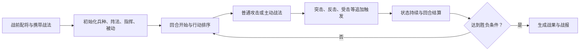

# 对话归档

- 会话 ID：`019feb22-6b9c-72f3-ac8b-2661424ab1b6`
- 开始时间：2026-08-10 18:05:29 CST
- 原工作目录：`/Users/yuanli/Documents/玩法知识库`
- 内容范围：仅保留用户与 Codex 的文字对话及用户附图；不包含平台系统/开发者指令、技能注入、工具调用和工具输出。

## 1. 用户

# Files mentioned by the user:

## 竞品战斗数据库(1): /Users/yuanli/Library/Containers/com.tencent.xinWeChat/Data/Documents/xwechat_files/wxid_ia4bby8x9wd121_e9c6/msg/file/2026-08/竞品战斗数据库(1)/

## My request for Codex:
这是ai帮我获取的竞品的战斗数据，你了解下这里面的内容，帮我梳理下战斗体系需要哪些内容

## 2. Codex

我会先盘点这份竞品数据库里的文件与字段，再按“战斗目标—核心循环—规则系统—内容配置—数值验证”梳理成一套可落地的战斗体系清单。这里涉及结构化数据分析，我会用数据分析流程检查覆盖度和缺口。

## 3. Codex

分析路线：竞品资料盘点 + 产品/战斗系统归纳 + 结构化报告。我会重点区分“竞品已经覆盖的内容”和“完整战斗体系仍需补齐的内容”。

## 4. Codex

资料由 1 份说明文档和 6 份 CSV 构成，覆盖《三国志·战略版》《率土之滨》《三国：谋定天下》的战法设计与版本来源。因为核心证据在表格里，我接下来会按电子表格分析规范读取并校验字段。

## 5. Codex

我会把“AI 抓取的数据”先当作竞品观察样本，而不是绝对权威数据：除了总结机制，还会检查空值、重复、口径漂移和来源完整性，避免把抓取噪声误当成战斗设计结论。报告里会明确哪些是数据事实、哪些是设计归纳。

## 6. Codex

表格正在做全量校验。目前会重点核对三组设计表与来源表是否一一对应，以及“赛季、类型、概率、获取方式、效果描述”这些设计字段是否足以支撑战斗体系分析。

## 7. Codex

阶段性结论已经比较清楚：这批资料是一套“战法内容库 + 证据追溯层”，不是完整的战斗系统定义。三款游戏合计 799 条战法、主表与来源表记录键全部一一匹配；但战斗公式、状态叠加、目标规则、行动队列、胜负与结算等仍需要单独建模。下一步我会把它整理成模块清单和建设优先级。

## 8. Codex

报告内容已成型，正在做最后的结构与图表校验。校验器发现图表引用字段需要改成当前格式，我会修正后再渲染，避免给你一个打不开或图表缺失的结果。

## 9. Codex

已完成梳理，并生成了应用内报告《三国竞品战斗体系梳理》。

核心结论：

- 现有资料共 799 条战法，双表记录键全部匹配。它是一套较完整的“战法内容库＋证据追溯层”，但还不是完整战斗体系。
- 完整体系需要补齐 12 个模块：战斗边界、实体属性、编队构筑、行动时序、目标选择、伤害治疗公式、状态效果、联动反制、战斗 AI、战报表现、内容版本、模拟与数据运营。
- 战法应从文本描述拆成“触发—条件—目标—效果—持续—分支”的结构化规则，同时保留原文用于审阅。
- P0 应先建设：事件时间线、效果原子、状态字典、目标规则、统一公式和确定性战斗日志；之后再迁移全部 799 条战法。
- 数据层仍有口径缺口：率土的概率、品质和武将关系较弱；三谋的概率、赛季等信息部分混在效果文本中；率土说明中的“双源核验”在当前来源表里也无法完整复核。

报告中已经包含战法类型对比图、十二模块清单、七类战法数据结构和 P0—P2 建设顺序。如果需要团队共享，我可以再把这份报告发布成网页。

## 10. 用户

我看到你列举了12个模块，构成一个战斗体系，你结合一个具体的游戏，给我举例，每个模块，他们是怎么设计的

## 11. Codex

我用《三国志·战略版》来展开，因为这份数据的赛季、类型和发动概率最完整，也包含兵种与阵法，比较适合把 12 个模块串成一套真实战斗流程。先从表里抽取能对应各模块的具体战法例子，再补充数据库没有直接记录、但从游戏规则可以还原的部分。

## 12. Codex

我会用一支典型“后期谋略盾”作为贯穿示例：主将承担核心输出，副将负责减伤、治疗和控制，再穿插《用武通神》《士别三日》《藤甲兵》《锋矢阵》《刮骨疗毒》等具体战法。这样能看到这些模块不是十二张孤立表，而是怎样在一场战斗里互相咬合。

## 13. Codex

可以。下面以《三国志·战略版》为例，并用一支“后期谋略盾”示意队贯穿说明。

示意构筑：

- 主将：核心谋略输出，携带《用武通神》《士别三日》
- 副将一：承担兵种与减伤，携带《藤甲兵》《抚辑军民》
- 副将二：承担阵法与治疗，携带《锋矢阵》《刮骨疗毒》

它体现了《三战》的核心设计思想：**玩家在战前完成大部分决策，战斗中由规则自动兑现，最后通过战报解释结果。**官方资料库也将武将、战法、兵种、装备以及主动、指挥、突击、被动、阵法等内容分别建库，说明这些模块在底层是分层设计的。[《三国志·战略版》官方资料库](https://sgzzlb.lingxigames.com/station/)



### 1. 战斗边界与目标

《三战》把单场战斗设计成一个有限回合的自动结算过程。战法《用武通神》分别在第2、4、6、8回合生效，说明内容设计天然分为：

- 前期：第1—3回合，减伤、控制、抢先手
- 中期：第4—5回合，爆发和恢复
- 后期：第6—8回合，成长型输出完成收割

示意队的目标不是第一回合爆发，而是利用前三回合减伤活下来，到第4回合同时迎来《士别三日》爆发、《用武通神》强化伤害和《抚辑军民》治疗。

设计启示：需要先明确最大回合、提前结束、平局、死亡和胜负判定，才能设计“速攻队”“中速队”“后期队”。

### 2. 战斗实体与属性

《三战》的基本战斗实体是由主将和副将组成的部队。核心属性至少包括：

- 武力：影响兵刃伤害及部分战法效果
- 智力：影响谋略伤害、治疗和部分减伤
- 统率：影响兵刃承伤和防御类效果
- 速度：影响行动顺序
- 兵力：既是生存资源，也会影响战斗输出能力
- 兵种与适性：决定部队定位和克制关系

主将和副将不是简单的位置区别。《锋矢阵》会强化主将输出、增加主将承伤，同时降低副将输出、降低副将承伤，所以“谁当主将”本身就是构筑决策。

### 3. 战前编队与构筑

玩家在战前需要决定：

- 三名武将的组合
- 谁担任主将
- 使用什么兵种
- 每名武将携带什么战法
- 是否使用阵法、兵种战法
- 阵营、属性和战法之间是否形成联动

示意队使用《藤甲兵》获得高额兵刃减伤，用《锋矢阵》把输出集中到主将，再通过《抚辑军民》和《刮骨疗毒》保证生存。

这意味着编队系统还要处理战法槽位、重复携带、兵种限制、武将统御、战法来源和阵容合法性。

### 4. 回合、事件与行动队列

《三战》的战法类型，本质上对应不同事件点：

- 被动：通常直接改变自身规则，如《士别三日》
- 指挥：战斗开始时提前部署，如《抚辑军民》
- 主动：武将行动时按概率发动，如《刮骨疗毒》
- 突击：普通攻击后追加触发，如《一骑当千》
- 阵法、兵种：战斗初始化阶段生效

示意队的执行顺序可以理解为：

1. 战斗初始化：《藤甲兵》《锋矢阵》《抚辑军民》生效。
2. 前三回合：《士别三日》禁止自身普攻，但提供规避。
3. 第2回合：《用武通神》第一次造成伤害。
4. 第4回合：《士别三日》爆发，《用武通神》再次强化输出，《抚辑军民》治疗。
5. 每次行动时，继续判断主动战法是否发动。

这里必须明确同一时点多个效果的优先级、打断、死亡后是否继续执行，以及目标死亡后的重新选择。

### 5. 目标选择与空间规则

《三战》大量使用规则化目标选择，而不是让玩家在战斗中手动点选。

例如：

- 《刮骨疗毒》：选择损失兵力最多的我军单体。
- 《暂避其锋》：分别选择智力最高和武力最高的我军武将。
- 《奇计良谋》：分别针对敌方武力最高和智力最高的武将。
- 《一骑当千》：攻击敌军全体。
- 《刮骨疗毒》发动时，如果原目标已死亡，还需要明确是否重新选取目标。

所以目标系统至少要支持阵营、数量、位置、随机、属性排序、兵力排序、主副将和目标失效后的重选。

### 6. 伤害、治疗与兵力公式

战法文本只展示“玩家可理解的倍率”，底层还需要统一公式。

例如：

- 《用武通神》造成谋略伤害，并受智力影响。
- 《刮骨疗毒》治疗率从128%成长到256%，受智力影响。
- 《抚辑军民》的减伤受统率影响，治疗受智力影响。
- 《藤甲兵》的兵刃减伤受统率影响。

因此底层需要区分：

- 兵刃伤害与谋略伤害
- 基础倍率与属性缩放
- 增伤、减伤、防御的计算顺序
- 暴击、奇谋、规避、抵御
- 治疗增减与禁疗
- 兵力损失是否影响后续输出
- 小数取整和上下限

如果这些规则没有统一公式，同一个“伤害提高30%”在不同战法里可能产生不同结果。

### 7. 状态与效果系统

《三战》的复杂度主要来自状态组合。

常见状态包括：

- 控制：缴械、计穷、震慑、混乱、虚弱
- 持续伤害：灼烧、中毒、沙暴、叛逃
- 防护：规避、抵御、援护、减伤
- 恢复：治疗、急救、休整
- 属性变化：武力、智力、统率、速度提升或降低
- 免疫和净化：洞察、清除负面状态

例如《夺魂挟魄》会偷取四种属性，持续2回合，并可叠加2次；《刮骨疗毒》会先清除负面状态，再恢复兵力。

状态系统必须明确持续时间从什么时候开始计算、能否叠加、同名状态是覆盖还是刷新、净化优先清除什么，以及来源死亡后状态是否保留。

### 8. 条件、联动与反制

《三战》并不是单纯比较数值大小，而是强调机制之间的克制。

典型例子：

- 《藤甲兵》大幅降低兵刃伤害，但受到灼烧时会额外损失兵力。
- 《盛气凌敌》使敌人缴械，直接压制依赖普攻和突击的队伍。
- 《太平道法》提高主动战法发动率，对准备战法加成更高。
- 《一举歼灭》遇到沙暴目标时追加混乱。
- 《锋矢阵》强化主将，却也让主将承受更多伤害。

好的反制设计不是简单的“A比B强”，而是“A在某种环境中强，但存在明确弱点”。这样玩家才会因为战场环境调整阵容。

### 9. 战斗AI与自动决策

《三战》的战斗内决策比较少，策略主要发生在战前。战斗中的“AI”更接近规则执行器：

- 到达行动时点
- 判断是否被控制
- 判断战法发动概率
- 按目标规则选择对象
- 按顺序执行效果
- 判断是否触发追击、反击、急救等后续事件

例如《刮骨疗毒》不需要玩家决定救谁，系统自动选择损失兵力最多的单位；《暂避其锋》在开战时自动根据属性排序选目标。

这种设计降低了操作负担，但要求目标规则、优先级和战报说明非常清楚。

### 10. 表现、战报与可解释性

自动战斗最怕玩家不知道为什么输。因此战报必须回答：

- 哪个战法在第几回合发动
- 发动概率是否判定成功
- 选择了哪个目标
- 造成多少伤害或治疗
- 哪个增减伤参与了计算
- 哪个控制阻止了行动
- 哪个状态发生叠加、覆盖或清除

例如面对藤甲队，战报需要让玩家看到“兵刃伤害被藤甲降低”，同时也要看到“灼烧触发藤甲额外损兵”。这样玩家才能理解克制关系并调整阵容。

表现层对应动画、特效、状态图标和飘字；战报层对应精确规则日志。二者最好来自同一套战斗事件数据。

### 11. 内容生产与版本管理

《三战》通过多个维度控制战法投放：

- 品质：S、A、B
- 类型：主动、指挥、突击、被动、兵种、阵法
- 赛季：S1、S2、S3、PK赛季
- 来源：武将自带、武将传承、事件兑换
- 角色关系：由哪些武将提供或携带

例如：

- 《锋矢阵》属于S1阵法战法。
- 《太平道法》在S2通过事件兑换投放。
- 《三势阵》在S3投放。
- 《威谋靡亢》属于PK赛季内容。

这种投放方式让战斗体系随赛季逐步增加复杂度，而不是首日就把所有机制开放给玩家。战法字段与具体效果均来自当前设计参考表：:codex-file-citation{path="/Users/yuanli/Library/Containers/com.tencent.xinWeChat/Data/Documents/xwechat_files/wxid_ia4bby8x9wd121_e9c6/msg/file/2026-08/竞品战斗数据库(1)/竞品战斗数据库/三国志战略版-战法设计参考.csv" purpose="source" artifact_kind="workbook"}

### 12. 模拟、平衡与数据运营

《三战》的平衡对象不是单个战法，而是“武将＋战法＋兵种＋阵法＋对局环境”。

示意队的强弱不能只看《用武通神》的伤害：

- 能否撑到第4、6、8回合
- 主将被控制的概率
- 藤甲遇到兵刃队还是火攻队
- 《刮骨疗毒》是否及时发动
- 《锋矢阵》集中主将输出后，主将是否更容易被击杀
- 多次随机战斗中的胜率和方差

因此需要通过大量不同随机种子的模拟，监控阵容胜率、出场率、战法携带率、平均战斗回合、伤害与治疗贡献、先手优势和克制关系。

最终可以把《三战》的战斗体系概括为：

> **以三武将编队为载体，以战法为规则节点，以回合事件为执行骨架，以兵种、阵法和状态联动形成构筑深度，再用战报和数值模拟保证可解释性与长期平衡。**

## 14. 用户

能不能用通俗易懂的语言来讲解三战的战斗体系，太复杂了，看不懂

## 15. Codex

可以。其实《三国志·战略版》的战斗，抓住一句话就够了：

> **战前组好三个人，战斗时系统自动执行技能，最后根据谁先被打垮判断输赢。**

你可以把它理解成一个“自动战斗版的三人卡牌游戏”。

| 游戏里的东西 | 通俗理解 |
|---|---|
| 武将 | 上场的角色 |
| 兵力 | 血量 |
| 武力 | 物理攻击 |
| 智力 | 法术攻击，也影响部分治疗 |
| 统率 | 物理防御 |
| 速度 | 谁先出手 |
| 战法 | 技能卡 |
| 兵种 | 职业 |
| 阵法 | 全队加成规则 |

### 一、战斗前，玩家主要做什么？

玩家需要组一支三人队：

- 一个主将
- 两个副将
- 给他们选择兵种
- 给每个人配置战法
- 决定谁输出、谁防御、谁治疗

《三战》真正的策略，大部分都发生在这里。

比如你可以组一支“慢热防守队”：

- 主将负责后期输出
- 一个副将负责减伤
- 一个副将负责治疗
- 前三回合先挨打
- 第四回合开始爆发

所以它不是让你在战斗中操作，而是考验你战前有没有把队伍搭好。

### 二、进入战斗以后会发生什么？

战斗进入回合制，最多打到第八回合。

每个回合可以简单理解为：

1. 速度快的人先行动。
2. 判断他有没有被控制。
3. 判断技能有没有发动。
4. 选择攻击目标。
5. 造成伤害、治疗或者施加状态。
6. 所有人行动结束后进入下一回合。

这些过程全部由系统自动完成。

### 三、战法有什么区别？

战法虽然看起来很多，但主要只有四种。

- **被动战法**：一直生效  
  例如让自己更硬、更容易闪避。

- **指挥战法**：开战时提前布置  
  例如前三回合全队减伤。

- **主动战法**：行动时有概率发动  
  例如40%概率治疗队友。

- **突击战法**：普通攻击后有概率追加  
  例如砍完一刀，再追加一次技能攻击。

兵种战法和阵法，可以理解成全队规则，例如让全队更抗打，或者让主将输出更高。

### 四、伤害是怎么来的？

游戏里主要有两种伤害：

- 兵刃伤害：主要看武力
- 谋略伤害：主要看智力

简单理解就是：

> 攻击者属性越高，技能倍率越高，造成的伤害通常越多；防守者统率、智力和减伤越高，受到的伤害通常越少。

玩家不需要计算具体公式，只需要知道这个武将适合打兵刃伤害还是谋略伤害。

### 五、为什么有些队伍会被另一支队伍克制？

因为队伍不是只比数值，还要比较机制。

例如：

- 藤甲兵特别怕火。
- 依赖普通攻击的队伍怕缴械。
- 依赖主动技能的队伍怕计穷。
- 爆发队怕前三回合减伤。
- 慢热队怕第一、第二回合就被打崩。

所以有时候战力高也会输，因为正好被对面的机制克制。

### 六、用一个简单例子串起来

假设我们组一支“慢热谋略盾”：

- 主将：负责第2、4、6、8回合输出。
- 副将一：前三回合帮助队伍减伤。
- 副将二：给兵力损失最多的人治疗。
- 全队使用藤甲兵，降低受到的兵刃伤害。

进入战斗后：

- 第1回合：主要依靠减伤挨打。
- 第2回合：主将第一次输出。
- 第3回合：继续防守和治疗。
- 第4回合：主将迎来一次明显爆发，同时队伍获得治疗。
- 第6、8回合：主将伤害越来越高。

这支队伍的思路就是：

> **只要前三回合没被打死，后面就越来越强。**

但是如果对面带火攻，藤甲兵的弱点被触发，这支队伍就可能很快失败。

### 七、玩家到底在玩什么？

归根结底，玩家只是在做三件事：

1. **选人**：哪三个武将一起上。
2. **配技能**：让他们分别负责输出、防守、治疗或控制。
3. **猜环境**：判断目前大家常用什么队伍，准备对应的克制办法。

所以《三战》的战斗体系可以压缩成一句最通俗的话：

> **三个武将带着各自的技能自动打八个回合；玩家的水平，主要体现在开战前怎么搭配，而不是战斗中怎么操作。**

## 16. 用户

输出、防守、治疗或控制，分别是指什么

## 17. Codex

这四个词说的是：一名武将在队伍里主要负责什么工作。

可以把一支队伍想象成三个人合作打架：

### 1. 输出：负责把敌人打倒

输出就是“伤害制造者”。

主要工作：

- 造成兵刃或谋略伤害
- 快速削减敌方兵力
- 在关键回合完成爆发

例如《用武通神》会在第2、4、6、8回合持续造成谋略伤害。携带它的武将，主要职责就是输出。

通俗理解：**队伍里的主攻手。**

### 2. 防守：负责让队伍不容易死

防守不是攻击敌人，而是减少己方受到的伤害。

主要方式：

- 降低敌人造成的伤害
- 提高自己的统率
- 获得减伤、规避、抵御
- 替队友承担伤害
- 保护主将

例如《藤甲兵》可以减少全队受到的兵刃伤害；《锋矢阵》可以让副将受到的伤害降低。

通俗理解：**队伍里的盾牌或坦克。**

### 3. 治疗：负责把损失的兵力补回来

治疗就是“回血”。

主要工作：

- 恢复己方兵力
- 优先救兵力最少的人
- 提供持续恢复
- 有时顺便清除负面状态

例如《刮骨疗毒》会找到兵力损失最多的队友，先清除负面状态，再恢复兵力。

通俗理解：**队伍里的医生。**

但治疗不能无限救人。如果敌人的伤害太高，队友直接被打垮，治疗可能还没发动就已经输了。

### 4. 控制：负责让敌人不能正常行动

控制不一定造成很多伤害，但能限制敌人。

常见控制包括：

- **缴械**：不能普通攻击
- **计穷**：不能发动主动战法
- **震慑**：不能行动
- **虚弱**：可以行动，但无法造成伤害
- **混乱**：可能攻击自己人
- **禁疗**：不能恢复兵力

例如《盛气凌敌》可以让敌人陷入缴械，特别克制依靠普通攻击和突击战法的队伍。

通俗理解：**负责捣乱、打断敌人节奏的人。**

### 一支队伍为什么四种都需要？

假设一支队伍只有输出：

- 伤害很高
- 但自己也很脆
- 可能还没出手就被打死

只有防守和治疗：

- 很难被打死
- 但自己没有足够伤害
- 最后可能打不赢

只有控制：

- 可以限制敌人
- 但控制有概率失败
- 仍然需要有人负责造成伤害

所以常见的队伍思路是：

> **一个人负责打伤害，一个人负责保护队伍，一个人负责治疗或控制。**

不过这不是固定分工。一名武将也可以同时承担两种职责，例如：

- 防守＋治疗
- 输出＋控制
- 治疗＋净化
- 输出＋降低敌人属性

最简单的记忆方式是：

- **输出：打人**
- **防守：挨打**
- **治疗：救人**
- **控制：不让敌人正常打**

## 18. 用户

策划说 slg 游戏最重要的是社会结构，并且举了些例子，，比如slg是基于社交行为的产品，所有设计都是服务于社交，数值决定了社交的形态，每个同盟多少人就是一个数值，会直接影响到社会结构，比如每个同盟100人和1000人，社会结构就完全不一样。你帮我看下，这个社会结构具体是指啥呢

## 19. Codex

策划说的“社会结构”，不是简单指聊天、加好友、组队这些社交功能。

一句话解释：

> **社会结构，就是游戏规则把玩家分成了哪些群体、角色和阶层，以及这些人之间形成什么样的合作、管理、竞争和利益关系。**

可以把它理解成游戏里的“小社会是怎么组织起来的”。

## 社交功能和社会结构的区别

- 聊天、好友、邮件：是社交工具。
- 同盟人数、官职权限、领土归属、奖励分配、宣战规则：决定社会结构。
- 玩家之间聊天的内容和关系，是社会结构运行后的结果。

比如游戏有同盟聊天，但大家平时都能单机发展，那么同盟聊天可能很冷清。

反过来，如果打城必须50个人同时参加，即使聊天功能很简单，大家也会主动拉群、排班、组建指挥体系。

所以真正产生社交的，不是“有没有聊天频道”，而是：

> **玩家是否需要别人、依赖谁、听谁指挥、和谁争夺利益。**

## 同盟100人和1000人，为什么完全不同？

### 同盟只有100人

100人的组织更接近一个熟人团队：

- 盟主大致认识活跃成员。
- 玩家比较容易记住谁厉害、谁可靠、谁经常划水。
- 管理结构比较简单，盟主加几个官员就能运转。
- 人情关系比较强，奖励分配可能通过协商解决。
- 一个成员退出，大家容易注意到。
- 玩家更容易形成“这是我们自己的同盟”的归属感。

社会结构可能是：

> 盟主 → 几个管理 → 普通成员

整体比较扁平，依靠熟人、信誉和人情管理。

### 同盟有1000人

1000人更像一家公司、军团或者国家：

- 盟主不可能认识所有人。
- 必须划分团、组、战区或者军团。
- 需要中层管理，否则命令传达不到基层。
- 需要正式的考勤、贡献、奖惩和晋升规则。
- 容易出现不同派系、小团体和利益集团。
- 普通成员认同的可能不是盟主，而是自己所在的小队或军团。
- 管理者掌握的信息、资源和分配权会形成权力差距。

社会结构可能变成：

> 盟主 → 核心管理层 → 军团长 → 团长 → 小队长 → 普通成员

这时候玩家之间不再主要依靠熟人关系，而是依靠职位、制度和组织流程。

所以“同盟人数上限”看起来只是一个数字，实际上决定了游戏里会出现熟人团队，还是大型官僚组织。

## 社会结构主要包含什么？

### 1. 玩家被分成哪些群体

例如：

- 个人
- 小队
- 军团
- 同盟
- 国家
- 阵营
- 服务器

群体规模越大，越需要分层管理；群体规模越小，越依赖熟人关系。

### 2. 群体里有哪些角色

SLG里常见的角色有：

- 盟主：决定方向
- 官员：负责管理
- 指挥：组织作战
- 外交：与其他同盟谈判
- 团长：管理一支小队
- 主力玩家：负责打架
- 铺路玩家：负责连接领土
- 后勤玩家：负责建营地、运输或支援
- 新人：接受保护和培养
- 高战玩家：拥有更强的话语权

这些角色不一定都是游戏正式设置的。有些是玩家因为规则需要，自发创造出来的。

### 3. 谁依赖谁

社会结构最核心的是“依赖关系”。

例如：

- 一个人打不下城，所以必须依赖同盟。
- 主力玩家需要别人铺路和建营地。
- 普通玩家需要高战保护。
- 高战玩家需要普通成员提供人数和执行力。
- 盟主需要成员服从指挥。
- 成员需要盟主争取领土和奖励。

如果每个人都能独立完成所有内容，那么游戏即使有同盟，也很难形成真正的社会。

### 4. 权力掌握在谁手里

要看谁拥有这些权力：

- 谁可以收人或踢人？
- 谁可以宣战？
- 谁可以标记攻击目标？
- 谁可以分配城池和奖励？
- 谁能看到重要情报？
- 谁能决定同盟迁往哪里？
- 谁能和其他同盟谈判？

权限越集中，社会越接近强人领导。

权限分散到军团和小队，社会就更接近分权组织。

### 5. 利益怎么分配

玩家为什么愿意加入和服从一个组织，最终往往和利益有关。

例如：

- 打下一座城，是所有人都有奖励，还是只有参与者有奖励？
- 稀有奖励只有10份，但同盟有100人，怎么分？
- 高战拿更多，还是按贡献分？
- 铺路、指挥和后勤有没有收益？
- 同盟失败时，谁承担损失？

分配规则会产生不同社会关系：

- 人人有份：强调集体合作。
- 按贡献分：强调效率和考勤。
- 管理分配：强化管理者权力。
- 抢到归个人：增加内部竞争。
- 只有少量名额：容易产生阶层和派系。

### 6. 群体之间是什么关系

同盟内部是合作关系，同盟之间可能是：

- 敌对
- 联盟
- 附庸
- 中立
- 临时合作
- 背叛
- 资源交换
- 共同对抗更大的敌人

如果一个服务器只能容纳一个最终赢家，就容易形成吞并和大联盟。

如果多个同盟可以共同获胜，就更容易出现长期外交联合。

胜利条件也在塑造社会结构。

## “数值决定社会形态”具体是什么意思？

很多看起来只是策划表里的数值，实际上会改变玩家关系。

例如：

- 打城需要10人：朋友小队就能完成。
- 打城需要100人：必须由同盟统一组织。
- 打城需要500人：需要多个军团甚至多个同盟合作。

再比如：

- 奖励100人都有：大家愿意集体行动。
- 奖励只有10人有：玩家会争抢名额。
- 每人可以占100块地：容易出现大地主。
- 每人只能占10块地：更依赖组织分配资源。
- 退盟后立刻能加新盟：玩家流动频繁，忠诚度低。
- 退盟后要等待48小时：背叛和跳槽成本变高。
- 行军只要1分钟：临时喊人就能打。
- 行军需要1小时：必须提前排兵、通知和协调。

所以策划说“数值决定社会结构”，意思是：

> **人数、时间、成本、奖励数量、权限数量和参与门槛，会决定玩家是组成小圈子、大军团、官僚组织，还是松散联盟。**

## 最简单的理解方式

分析一个SLG的社会结构，可以只问六个问题：

1. 玩家必须和多少人合作？
2. 玩家为什么需要这些人？
3. 谁负责指挥和做决定？
4. 谁掌握资源和奖励分配权？
5. 不合作、退出或背叛要付出什么代价？
6. 同盟之间是竞争、联合还是吞并关系？

这六个问题的答案组合起来，就是这个SLG的社会结构。

因此，SLG真正设计的往往不只是一场战斗，而是：

> **用领土、资源、时间、人数和奖励，把玩家组织成一个社会，再让这个社会产生合作、权力、荣誉、矛盾和战争。**

## 20. 用户

三战里面是啥样呢

## 21. Codex

我按“三战里玩家实际怎么被组织起来”来拆，不讲抽象概念：从一个普通玩家，怎么进入同盟、被编进战斗小组，再到同盟之间结盟或开战。

## 22. Codex

《三国志·战略版》里的社会结构，可以简单理解为：

> **以同盟为核心，把一群玩家组织成一支长期作战的军队。**

玩家不是简单地“加个公会领福利”，而是要一起铺路、打城、守关、抢州、谈外交，最后争夺洛阳和赛季奖励。官方对经典S1赛季的概括就是“选州—组建同盟—建立国家—攻取洛阳—争夺霸业”。[《三国志·战略版》赛季介绍](https://sgzzlb.lingxigames.com/website/)

## 它的社会大概分成五层

```text
整个服务器/赛季
└── 州、阵营或国家
    └── 主盟、分盟、友盟、敌盟
        └── 军团、战斗小组
            └── 单个玩家
```

其中：

- 州、阵营、国家，是最大的身份。
- 同盟，是玩家最主要的归属单位。
- 军团和小组，很多不是系统强制规定，而是玩家为了方便管理自发组建的。
- 单个玩家拥有自己的城池、土地、资源和部队。

所以三战的核心社会单位不是“个人”，而是“同盟”。

## 玩家是怎么进入这个社会的？

一个普通玩家的经历通常是：

1. 刚进游戏时，自己开荒、占地、发展城池。
2. 加入一个同盟，获得保护和发展空间。
3. 被编入某个战斗组或者军团。
4. 根据实力承担打架、铺路、攻城、驻守等任务。
5. 跟随同盟争夺城池、关口和州府。
6. 最后参与同盟之间的大规模战争。

玩家越往后玩，个人目标就越容易变成集体目标：

- 开始想的是“我要打高级地”。
- 后来想的是“我们盟今晚要打城”。
- 再后来想的是“我们州能不能进入资源州”。
- 最后想的是“我们能不能拿下洛阳和霸业”。

这就是游戏把个人逐渐社会化的过程。

## 同盟内部是什么结构？

系统里可能只有盟主、官员、成员等正式职位，但玩家实际会发展出更复杂的分工。

### 最高管理层

通常包括：

- 盟主
- 副盟主或核心管理
- 总指挥
- 外交负责人
- 管理考勤和奖励的人

他们决定：

- 今天打哪里
- 和谁开战
- 和谁结盟
- 哪些人进入主盟
- 城池、资源和奖励怎么分
- 是否放弃某片土地或进行战略转移

这群人相当于同盟的“政府和军队司令部”。

### 中层管理

通常包括：

- 军团长
- 团长
- 小组长
- 前线指挥
- 攻城负责人

他们负责把管理层的命令变成具体行动。

例如盟主说“今晚八点打某座城”，中层需要安排：

- 谁负责铺路
- 谁先打守军
- 谁上攻城队
- 谁负责驻守
- 谁防止敌人偷袭
- 成员什么时候上线

没有中层，盟主不可能直接指挥几百个人。

### 普通成员

普通成员也会因为实力和时间不同，形成不同角色。

- 高战玩家：负责前线打架、突破敌人。
- 活跃玩家：负责长时间驻守、支援。
- 铺路玩家：负责连接目标地点。
- 攻城玩家：准备攻城值较高的队伍拆城。
- 后勤玩家：建营帐、补兵、搬城、协助防守。
- 新人或低战玩家：负责低风险任务，同时接受同盟保护。

所以低战玩家不一定完全没用。SLG会尽量让“战斗力之外的贡献”也有价值，否则同盟只会需要少数高战玩家。

## 为什么大家必须听指挥？

因为三战的很多目标，单个人根本做不了。

最典型的就是打城。

假设同盟准备晚上八点攻打一座城：

1. 有人提前铺路，把同盟领地连到城旁边。
2. 主力玩家先消灭城池守军。
3. 攻城队再拆除城池耐久。
4. 其他人防止敌对同盟干扰。
5. 战败的人需要补兵，再返回战场。
6. 指挥需要控制开始时间，避免大家各打各的。

如果有人提前开打，守军恢复或者攻城节奏被打乱，可能导致整个同盟失败。

于是游戏规则自然制造出了：

- 统一行动时间
- 指挥权
- 纪律
- 考勤
- 奖惩
- 成员对管理层的服从

游戏没有强迫玩家建立这些制度，但攻城规则迫使玩家自己建立。

## 为什么会形成主盟、分盟和友盟？

一个同盟的人数和管理能力有限，但大型战争需要更多玩家。

于是玩家会建立：

- 主盟：收战斗力和活跃度最高的玩家。
- 分盟：容纳发展中的玩家或后备成员。
- 友盟：和主盟合作，但保留自己的管理层。
- 敌盟：争夺土地、城池和赛季胜利。
- 国家或阵营：把多个组织放进更大的共同目标中。

三战没有简单地把所有人塞进一个上千人的超级同盟，而是更容易形成：

> **一个核心同盟，加若干分盟、友盟和合作组织。**

这样既保留了中等规模同盟的管理和归属感，又能组成更大的政治集团。

## 数值怎样影响三战的社会结构？

### 土地数量

土地有限，玩家之间会产生：

- 抢地
- 让地
- 资源分配
- 同盟内部保护区
- 高战和低战之间的矛盾

如果资源无限，很多内部管理规则就不会出现。

### 行军时间

距离越远，支援越慢，因此会出现：

- 前线成员
- 后方成员
- 迁城要求
- 营帐和补给安排
- 分区管理

时间数值把同盟变成了一个有前线和后方的军事组织。

### 攻城人数和时间

攻城需要大量玩家在固定时间集合，所以会产生：

- 统一指挥
- 上线通知
- 考勤
- 军团分组
- 违纪处罚

如果三个人就能随时打城，就不需要这种组织结构。

### 同盟人数上限

人数太少，同盟更像熟人小队。

人数达到数百人规模后，盟主无法认识和管理所有人，于是必须出现军团长、小组长等中层角色。

### 赛季奖励

如果重要奖励和同盟排名、城池占领、霸业资格有关，玩家就会在意：

- 自己能否进入主盟
- 谁能获得奖励名额
- 是否应该服从管理
- 是否要跳槽到更强的同盟
- 弱盟是否应该合并或投降

奖励把“合作关系”进一步变成了“利益关系”。

## 同盟之间又是什么关系？

三战里的同盟不会只有“朋友”和“敌人”两种关系，还会出现：

- 暂时停战
- 共同对付强敌
- 借道
- 交换城池
- 合作进入资源州
- 主盟吸收弱盟
- 战败同盟成为附属
- 分赃不均导致翻脸
- 赛季末为了奖励重新站队

这部分就是SLG里的政治和外交。

很多玩家真正沉迷的不是某一次战斗，而是：

- 谁背叛了谁
- 哪个盟突然倒戈
- 哪个指挥完成了翻盘
- 哪个高战被全服针对
- 哪两个同盟因为奖励分配闹翻

这些玩家故事，就是社会结构运行后产生的内容。

## 总结

三战里的社会结构，大致是一种“军事同盟社会”：

- 玩家用城池和部队作为个人资产。
- 同盟提供保护、资源、土地和集体目标。
- 管理层掌握战略、外交和分配权。
- 中层负责组织军团和执行命令。
- 成员按照战斗力、活跃度和贡献形成分工。
- 多个同盟之间进行合作、战争、吞并和背叛。
- 洛阳、城池和赛季奖励让这些关系持续运转。

最简单地说：

> **三战用土地迫使玩家发生关系，用攻城迫使玩家组织起来，用战争迫使玩家服从指挥，再用赛季奖励让所有人愿意长期留在这个组织里。**

## 23. 用户

你怎么理解 slg 的玩法

## 24. 用户

你怎么理解 slg 的玩法

## 25. 用户

你怎么理解 slg 的玩法

## 26. 用户

你怎么理解 slg 的玩法

## 27. Codex

我理解的 SLG，不是“建城＋抽卡＋打架”。

它本质上是：

> **用资源、土地、时间和规则，把一群玩家组织成社会，再让他们为了有限目标合作、竞争、谈判和战争。**

战斗只是手段，真正的玩法是“人和人怎么一起赢”。

玩家实际在玩四件事：

1. **发展自己**  
   升城、攒资源、养武将、配队伍。  
   这不是最终目的，而是拿到“上桌资格”——你得有能力参与同盟的战争和分配。

2. **争夺空间**  
   地图上的土地、城池、关口、资源州都有限。  
   有限空间让玩家必须选择：抢、守、让、合作、绕路，或者开战。

3. **组织人与人**  
   一个人通常做不了大目标，于是出现同盟、指挥、外交、军团、主力、铺路、攻城、后勤。  
   这部分才是 SLG 最有生命力的地方：玩家会自发形成职位、纪律、信誉、派系和故事。

4. **争夺赛季结果**  
   谁占了核心城池、谁控制关键区域、哪个阵营拿到霸业，决定了一个赛季的胜负和奖励。  
   赛季结算给前面的合作、战争、背叛和选择一个结果，再开启下一轮社会重组。

可以把它看成这样：

```text
个人发展
→ 加入组织
→ 占地、打城、守关
→ 内部分工与奖励分配
→ 同盟外交和战争
→ 赛季胜负与重组
```

所以，SLG的核心不是“我的队伍能不能打赢一队敌人”，而是：

> **我的能力能不能让组织更强；组织能不能让我拿到个人拿不到的东西；我们能不能比另一群人更好地协作。**

这也解释了为什么 SLG 的数值很重要，但数值不是孤立的。

- 同盟人数上限，决定是熟人小队还是大型组织。
- 攻城需要多少人，决定要不要指挥和考勤。
- 行军要多久，决定前线、后方和调度是否存在。
- 奖励给多少人，决定内部是共享、按贡献分，还是争名额。
- 土地是否有限，决定玩家会不会抢地、让地和谈判。
- 退盟、换盟成本多高，决定忠诚、背叛和外交有没有分量。

我会把好的 SLG 总结成一句：

> **它让不同强度、不同在线时间、不同性格的玩家，都能在一个共同战争目标里找到位置，并因为彼此依赖而产生真实关系。**

因此，战斗系统负责“谁能赢一场”，而社会结构决定“为什么一群人愿意长期一起打下去”。

## 28. 用户

三战 三谋 这些 slg 游戏分别是怎么设计的呢

## 29. Codex

我会沿着前面“SLG 是怎样把人组织起来”的角度来对比《三国志·战略版》（三战）和《三国：谋定天下》（三谋），重点讲它们各自让玩家“为什么聚在一起、怎么打仗、怎么分工”。

## 30. Codex

两款都在做“赛季地图上的同盟战争”，但设计重点不一样：三战更像把玩家训练成一支能统一行动的军队；三谋更像先把军队拆成不同工种，让更多人都能有用。接下来我用这个差别展开。

## 31. Codex

可以把它们看成两种不同的“组织玩家打仗”的方案。

| | 三战 | 三谋 |
|---|---|---|
| 核心感觉 | 一支靠指挥调度打仗的大军 | 一支有明确工种配合的军队 |
| 玩家分工 | 大多是玩家自己慢慢形成 | 一部分被职业系统直接规定出来 |
| 最重要的能力 | 战力、在线配合、听指挥、执行力 | 除了战力，还看你能否提供职业功能 |
| 社会结构 | 更偏“同盟—管理层—团—成员”的层级组织 | 更偏“同盟—不同职业小组—协作网络” |

一句话说：

- 三战是“先有战争任务，再逼玩家自发分工”。
- 三谋是“先把分工做成职业，再让玩家围绕职业配合”。

### 三战：用土地和攻城，逼出一支有纪律的同盟

三战的主线很直接：选州、组同盟、建国家、攻城、争霸业。地图上的关卡、城池、行军距离和攻城时间，都会让一个人很难独立完成目标；于是必须进同盟、听指挥、按时间集合。官方对玩法主线的表述也是“自由选州，组建同盟，建立国家，攻取洛阳，争夺霸业”。[三战官网](https://sgzzlb.lingxigames.com/website/)

它的特点是：系统不直接给你贴“职业”标签，但玩家会自己长出角色。

比如一次攻城：

- 高战负责清守军、打架；
- 铺路的人把路连到前线；
- 攻城队负责最后拆城；
- 管理负责定时间、分团、发邮件；
- 外交负责谈停战、拉盟友、判断敌对关系；
- 普通成员负责按时到位、出队、补位。

所以三战的社会结构，是“自然长出来的”。

系统只提供了土地、城池、关卡、奖励这些硬规则；玩家为了赢，自己发展出盟主、指挥、团长、高战、铺路、攻城、外交等位置。谁能调动人、分配奖励、决定打谁，谁就有权力。

它的爽点是：你会觉得自己真的在参加一场大规模战争。  
它的代价是：组织成本高，指挥累，成员也需要较强的执行力。

### 三谋：把“分工”直接设计进规则里

三谋同样是赛季沙盘战争，但它把“你能为同盟做什么”做得更显性。它设计了镇军、青囊、奇佐、天工、神行、司仓等六类职业；官方描述中，这些职业会从补给、战术、地形、局势等方面影响战场。[三谋官方 Steam 页面](https://store.steampowered.com/app/4542640/_/?l=japanese)

通俗说，三谋不希望所有人都只有一种价值：**战力高，才能有用。**

它试图把同盟里的价值拆开：

- 镇军：偏前线作战；
- 青囊：偏恢复、支援；
- 神行：偏快速行动、突袭；
- 天工：偏建设、器械、地形利用；
- 奇佐：偏计策和战术干扰；
- 司仓：偏资源和发育保障。

于是同样打一场城，三战更像“大家按指挥集合，把部队压过去”；三谋则更强调“谁负责前线、谁保障补给、谁做机动、谁提供战术条件”。

这里最重要的设计变化是：

> 三战中，分工主要由玩家社会自己形成；  
> 三谋中，分工有一部分被游戏规则提前写好了。

这会带来不同的社会形态。三战里，一个普通玩家往往要靠在线、听指挥、铺路、攻城来证明自己有价值；三谋里，哪怕战斗队不是最强，也可能通过职业能力成为同盟需要的人。

### 两者本质上都在做同一件事

它们都不是单纯设计“武将怎么打”，而是在设计：

**玩家为什么需要别人，以及别人为什么需要你。**

- 三战更擅长塑造“大同盟、强指挥、强纪律、强政治”的战争社会；
- 三谋更擅长塑造“多角色、多协作点、低战也能有功能价值”的团队社会。

所以我会这样概括：

> 三战把社会结构交给战争压力来塑造。  
> 三谋把社会结构的一部分，直接做成了职业与协作规则。

两者的难点也不同：三战要防止高战和管理层把普通成员边缘化；三谋要防止职业沦为形式，最后大家仍只认最高战力。真正好的 SLG，不是让所有人都能打，而是让不同类型的人都能在同一个胜利目标里发挥作用。

<oai-mem-citation>
<citation_entries>
MEMORY.md:52-64|note=[used prior SLG social-structure framing and user preference for concrete plain-language explanation]
rollout_summaries/2026-08-10T10-05-29-gDNc-slg_battle_system_explanation_and_social_structure.md:124-144|note=[used prior 三国志战略版 alliance organization analysis]
</citation_entries>
<rollout_ids>
019feb22-6b9c-72f3-ac8b-2661424ab1b6
</rollout_ids>
</oai-mem-citation>

## 32. 用户

三谋中，分工有一部分被游戏规则提前写好了。---具体是怎么写的呢

## 33. Codex

我把“三谋把分工写进规则”拆成具体的机制讲：不是玩家口头说“你当后勤”，而是选了职业后，会拿到不同的地图能力和能影响战局的手段。

## 34. Codex

关键在于：三谋把“玩家在大地图上能做什么”按职业拆开了。

不是你在同盟里口头说“我负责后勤”，而是系统真的给你一套只有这个职业能用的天赋、技能和成长线：

`选职业 → 获得专属天赋树/技能 → 能影响地图上的特定事情 → 同盟因此需要你`

而且职业天赋需要天赋点来激活，有自己的成长；职业技能在冷却时也不能随便重置。这意味着它不是一个称号，而是一种持续投入的玩法身份。[职业系统说明](https://www.taptap.cn/moment/531490898068899243)

最容易理解的是：**职业不等于你队伍里的武将定位。**

- 武将、战法、兵种：决定你这一队能不能打赢别人；
- 职业：决定你这个玩家能怎样影响整张地图和同盟战争。

例如：

| 职业 | 系统赋予的地图价值 | 同盟里自然形成的角色 |
|---|---|---|
| 镇军 | 更偏正面作战与前线 | 打架主力、前排 |
| 青囊 | 更偏支援与恢复 | 战场保障 |
| 神行 | 更偏快速行动、迂回 | 侦察、突袭、救火 |
| 奇佐 | 更偏计谋与战术干扰 | 军师、骚扰组 |
| 天工 | 更偏机关、建设、攻防设施 | 攻城、建造组 |
| 司仓 | 更偏屯田、资源、辎重保障 | 后勤、发育保障 |

这些并不只是“角色设定”。官方介绍明确把职业天赋和技能放在补给、战术、地形、局势这些沙盘层面；也就是说，它们会影响一场战争怎样打，而不只是让某个武将多一点属性。[三谋官方介绍](https://store.steampowered.com/app/4542640/_/)

拿“攻下一座城”举例就很清楚：

- 三战里，指挥会喊：高战清守军，其他人出攻城队，大家按时间到位。
- 三谋里，除了这些，还会更明确地需要不同职业提供条件：前线作战、快速绕后、建设攻城手段、补给辎重、战术干扰等。

例如公开的职业介绍中提到，城池攻下后，司仓可用职业技能快速增加城池或同盟大营的辎重；天工则被放在攻城战的核心位置。[三谋官方职业说明](https://www.taptap.cn/moment/552941995383851915)

所以两者最本质的区别是：

> 三战：玩家先因为战争需要而自发分工。  
> 三谋：系统先给出分工工具，再让玩家围绕这些工具协作。

这会让三谋里的“低战玩家”更容易获得明确价值：他未必是最能打的，但可能是同盟当前最缺的神行、天工或司仓。职业系统本质上是在把“我为什么对组织有用”写进规则里。

<oai-mem-citation>
<citation_entries>
MEMORY.md:62-64|note=[used prior SLG social-structure distinction between rules and social tools]
rollout_summaries/2026-08-10T10-05-29-gDNc-slg_battle_system_explanation_and_social_structure.md:117-122|note=[used rule-driven roles and dependencies framing]
</citation_entries>
<rollout_ids>
019feb22-6b9c-72f3-ac8b-2661424ab1b6
</rollout_ids>
</oai-mem-citation>

## 35. 用户

三战 是什么时候出来的

## 36. Codex

我查一下准确的公测上线时间，避免把预约、测试和正式公测混在一起。

## 37. Codex

《三国志·战略版》在 **2019 年 9 月 20 日上午 10 点**开启全平台不删档公测，通常也把这一天视为正式上线时间。[官方公测公告](https://sgz.ejoy.com/huodong/detail-4097.html)

## 38. 用户

你帮我检索到三战三谋的社会结构内容，放在我本地文件夹中，分好类，你先列你的计划

## 39. Codex

计划如下，先不开始检索和写入，等你确认。

1. 在当前知识库下新建一个研究目录：  
   `SLG社会结构研究/`

2. 先收集一手资料，分别梳理三战、三谋的：
   - 赛季目标与地图规则
   - 同盟/阵营组织方式
   - 攻城、土地、行军、补给等协作机制
   - 职位、权限、奖励与贡献
   - 退出、转盟、外交、合盟等关系成本
   - 三谋的职业系统如何改变同盟分工

3. 补充少量高质量的官方攻略、开发者内容或权威社区资料，用来解释“这些规则实际让玩家形成了什么关系”。  
   我会把“游戏明文规则”和“我的设计解读”分开写，避免混在一起。

4. 按下面结构整理本地文件：

```text
SLG社会结构研究/
├── 00_阅读说明.md
├── 01_三国志战略版/
│   ├── 01_社会结构总览.md
│   ├── 02_同盟与权力结构.md
│   ├── 03_协作机制_土地行军攻城奖励.md
│   ├── 04_玩家角色与分工.md
│   └── 来源索引.md
├── 02_三国谋定天下/
│   ├── 01_社会结构总览.md
│   ├── 02_同盟与权力结构.md
│   ├── 03_职业系统与分工.md
│   ├── 04_协作机制_地图战术补给攻城.md
│   └── 来源索引.md
└── 03_横向对比/
    ├── 三战_vs_三谋_社会结构对比.md
    └── 可复用的SLG社会结构设计框架.md
```

5. 每篇内容都采用同一种好读的写法：

```text
规则是什么
→ 玩家因此必须怎样合作
→ 最终形成什么组织/角色/权力关系
→ 对产品体验有什么好处与风险
```

6. 最后产出一份横向结论：  
   三战怎样通过“战争压力”让组织自然长出来；三谋怎样通过“职业规则”把部分分工提前写进系统，以及两种方案各自适合什么产品目标。

确认后我就开始检索、分类并写入本地文件。

## 40. 用户

除了三战三谋，还有哪些竞品呢，slg 游戏这块

## 41. Codex

我先按“是否值得研究社会结构”来筛，不把所有带 SLG 标签的游戏都塞进来：一类是三战、三谋这种赛季地缘战争的直接竞品；另一类是同盟组织方式很有参考价值的泛 SLG。

## 42. Codex

有。若目标是研究“SLG 怎样组织玩家”，我建议不要只找题材相近的，而要找“社会结构设计不同”的样本。

最值得加入你这次研究目录的，是下面 6 款：

| 优先级 | 游戏 | 为什么值得研究 |
|---|---|---|
| 必做 | **率土之滨** | 三战、三谋都绕不开的经典地缘赛季 SLG。重点看同盟外交、州战、赛季重组，以及“玩家自发形成组织”的方式。它有大地图、同盟协作和赛季挑战，是三战最重要的参照系之一。[率土官方应用介绍](https://play.google.com/store/apps/details?hl=zh&id=com.entermate.stzb) |
| 必做 | **世界启元** | 同样是赛季制联盟战争，但文明、科技、时代演进是它的差异点。重点看联盟怎样做全赛季规划、成员怎样围绕阶段目标协作。[世界启元联盟赛季规划](https://bbs.4399.cn/thread-view-tid-45903584) |
| 必做 | **万国觉醒** | 不是传统“三国率土式”SLG，而是实时行军、联盟领地、旗帜扩张、迁城靠拢。它特别适合研究“空间距离怎样塑造组织密度”。 |
| 必做 | **万龙觉醒** | 可以看作《万国觉醒》一套联盟领土战争思路在魔幻题材下的变体；有扩张领地、联盟巨兽等机制，适合研究联盟工具如何增加集体身份感。[万龙觉醒官方应用介绍](https://play.google.com/store/apps/details?hl=zh&id=com.farlightgames.samo.gp.tw) |
| 推荐 | **无尽冬日** | 不是传统赛季地缘 SLG，但非常值得研究“强同盟运营”。领地、旗帜、堡垒、集结、官职与联盟贡献，把成员活跃和管理层权力绑定得很紧。[联盟领地说明](https://wjdrgl.wjdr.cn/territory/alliance-territory/) |
| 推荐 | **Last War** | 同样偏泛 SLG，但可研究更轻量、高频的联盟管理：R4/R5 能设置同盟集合点，集结、迁移与活动时间都围绕联盟组织展开。[Last War 帮助中心](https://firstfungroup.zendesk.com/hc/zh-cn/articles/39668738466067--%E5%90%8C%E7%9B%9F%E9%9B%86%E5%90%88%E7%82%B9-%E6%98%AF%E4%BB%80%E4%B9%88) |

可以把它们分成三组：

```text
第一组：传统赛季地缘 SLG
率土之滨 / 三战 / 三谋 / 世界启元
→ 研究“土地、城池、赛季、外交，怎样逼出同盟政治”

第二组：实时领土联盟 SLG
万国觉醒 / 万龙觉醒
→ 研究“迁城、旗帜、行军距离，怎样让玩家抱团”

第三组：强联盟运营型泛 SLG
无尽冬日 / Last War
→ 研究“活动、集结、职位、贡献，怎样维持大组织活跃”
```

此外，**文明与征服、重返帝国、鸿图之下**也可以作为历史样本看，但我不建议放进第一批重点研究：它们对你要研究的“当前社会结构设计”参考价值相对低一些。

如果按研究效率排序，我建议这次目录扩展为：

> 三战、三谋、率土、世界启元、万国觉醒、无尽冬日。

这 6 款已经能覆盖三种不同答案：

- 用战争压力逼出组织；
- 用职业规则写入分工；
- 用领土与高频联盟活动维持社交。

<oai-mem-citation>
<citation_entries>
MEMORY.md:56-64|note=[used prior competitor-database scope and SLG social-structure research framing]
</citation_entries>
<rollout_ids>
019feb22-6b9c-72f3-ac8b-2661424ab1b6
</rollout_ids>
</oai-mem-citation>

## 43. 用户

那你基于这些竞品，出个计划吧

## 44. 用户

继续

## 45. Codex

好，我把这项工作拆成一套可以直接执行的竞品研究计划。

目标不是写成游戏百科，而是回答 6 个问题：

1. 玩家必须和谁合作？
2. 为什么必须合作？
3. 同盟内部如何分工？
4. 谁负责指挥和分配资源？
5. 奖励怎样影响权力关系？
6. 玩家为什么留下，为什么不退出？

## 一、研究对象

### 第一组：核心竞品

重点研究这 4 款：

- 《三国志·战略版》
- 《三国：谋定天下》
- 《率土之滨》
- 《世界启元》

这几款都是以赛季、土地、城池、同盟战争为核心，适合直接对比。

### 第二组：社会结构参考竞品

补充研究：

- 《万国觉醒》
- 《万龙觉醒》
- 《无尽冬日》
- 《Last War》

它们不完全属于三战式 SLG，但在联盟领地、集结、职位、贡献、迁城和联盟活动方面有参考价值。

## 二、每款游戏统一研究 10 个模块

不管是什么游戏，都用同一套问题分析：

1. 基本目标  
   玩家最终争什么？洛阳、王城、排名、领土，还是联盟活动奖励？

2. 核心组织单位  
   玩家是以个人、联盟、国家、服务器，还是职业小组为单位行动？

3. 人数和层级  
   一个联盟大概多少人？有没有主盟、分盟、团长、管理层？

4. 玩家分工  
   有没有明确职业？哪些角色是系统规定的，哪些是玩家自己形成的？

5. 合作机制  
   玩家如何一起打城、铺路、集结、运输、驻防或建设？

6. 权力来源  
   谁拥有指挥权？谁掌握资源、外交和奖励分配权？

7. 奖励机制  
   奖励给个人还是给联盟？如何决定谁拿高奖励？

8. 外交关系  
   游戏如何产生盟友、敌人、合盟、停战、吞并和背叛？

9. 时间与退出成本  
   玩家为什么要按时上线？退出同盟、转区、转服会损失什么？

10. 低战玩家价值  
    战力不高的玩家还能通过什么方式为组织做贡献？

## 三、研究顺序

### 第一阶段：三战、三谋、率土、世界启元

这是最重要的一组，主要回答：

> 传统赛季地缘 SLG，是怎样把玩家组织成一个国家或军队的？

重点对比：

- 土地是否稀缺；
- 城池是否需要多人协作；
- 行军距离是否制造组织压力；
- 同盟人数如何影响管理层级；
- 分盟和主盟如何形成；
- 奖励如何制造高战、管理、普通成员之间的关系；
- 三谋的职业系统与其他三款相比，究竟改变了什么。

### 第二阶段：万国觉醒、万龙觉醒

主要回答：

> 实时行军、联盟旗帜和领土扩张，怎样影响玩家抱团？

重点看：

- 联盟领地如何建立；
- 玩家为什么要迁到盟友附近；
- 旗帜、资源点、据点怎样制造联盟边界；
- 集结和即时支援如何制造在线组织；
- 联盟领袖为什么拥有更强权力。

### 第三阶段：无尽冬日、Last War

主要回答：

> 更轻量、高频的 SLG，是怎样维持联盟活跃的？

重点看：

- 联盟活动频率；
- 集合点和集结机制；
- R4/R5 管理权限；
- 贡献排行榜；
- 堡垒、王城、服务器活动；
- 普通玩家如何通过活跃而不是纯战力获得价值。

## 四、本地文件结构

我建议统一放在：

`/Users/yuanli/Documents/玩法知识库/SLG社会结构研究/`

目录结构如下：

```text
SLG社会结构研究/
├── 00_研究说明与分析方法.md
├── 01_三国志战略版/
├── 02_三国谋定天下/
├── 03_率土之滨/
├── 04_世界启元/
├── 05_万国觉醒/
├── 06_万龙觉醒/
├── 07_无尽冬日/
├── 08_Last_War/
├── 09_横向对比/
└── 10_社会结构设计结论/
```

每个游戏目录统一包含：

```text
01_社会结构总览.md
02_组织层级与权力.md
03_玩家分工.md
04_合作与战争机制.md
05_奖励与贡献.md
06_外交与退出成本.md
07_对我方产品的启发.md
来源索引.md
```

## 五、最后形成 3 份核心结论

### 1. 竞品对比表

统一比较：

```text
游戏
核心组织单位
联盟人数
是否有职业
战争目标
主要分工
权力来源
奖励方式
低战玩家价值
退出成本
```

### 2. 社会结构类型归纳

预计会归纳出几种类型：

- 三战型：靠土地、城池、行军和战争压力形成组织；
- 三谋型：把职业和地图能力直接写进分工；
- 率土型：更强调同盟自治、外交和玩家自组织；
- 万国型：靠联盟领地、迁城和实时集结组织玩家；
- 无尽冬日型：靠高频活动、贡献和联盟职位维持活跃。

### 3. 对自身产品的设计建议

最终不只是总结竞品，还要回答：

- 我们的同盟应该多大？
- 是否需要主盟和分盟？
- 是否要设计明确职业？
- 普通玩家靠什么体现价值？
- 谁可以指挥、分配奖励？
- 怎样让玩家不得不合作？
- 怎样避免同盟变成只有高战玩家有用？
- 赛季结束后，组织关系如何重组？

最终的核心产出，会是一句话：

> 哪些规则会让玩家产生稳定的关系、分工、权力和依赖。

下一步就可以按这个顺序，先从三战、三谋、率土、世界启元四款核心竞品开始整理。

## 46. 用户

帮我形成一份 txt，落在我本地

## 47. Codex

我现在把刚才的竞品研究计划整理成一份可直接使用的 TXT，放到当前知识库目录下。文件会包含研究对象、分析维度、执行顺序、目录结构和最终产出。

## 48. Codex

计划已整理完成，文件已落在本地：

[SLG竞品社会结构研究计划.txt](/Users/yuanli/Documents/玩法知识库/SLG社会结构研究/SLG竞品社会结构研究计划.txt)

目录位置：

`/Users/yuanli/Documents/玩法知识库/SLG社会结构研究/`

## 49. 用户

注意接下来检索数据的有效性：注意数据来源的可靠性就行，因为有些问题依赖玩家社群反馈而不是游戏设计内容，你出下方案，且需要自己审查下

## 50. 用户

继续

## 51. Codex

接下来我会把“资料可靠性”和“玩家社群反馈”拆开管理，并在每轮检索后做一次自查。我会使用数据质量审查方法来定义证据等级、冲突处理和结论准入规则，再把方案补进本地计划。

## 52. Codex

方案的核心是“双轨取证”：游戏规则用官方和实测确认；玩家实际形成的组织、潜规则和痛点，用跨社群的多样本反馈确认。单一攻略、论坛帖子或自媒体观点只能作为线索，不能直接写成结论。

## 53. Codex

我做了一遍自审，补了两个容易被忽略的风险：第一，三个社群样本只能证明“反复出现”，不能证明“多数玩家如此”；第二，要识别搬运、营销和身份不明的内容，不能只看文章写得是否详细。

## 54. Codex

已补充资料有效性与自审方案，并更新总计划。

核心规则是：

- 游戏规则：只以官方公告、帮助中心、版本说明或可复现的游戏内证据为准。
- 玩家行为：必须跨多个独立社群、赛季或同盟交叉验证。
- 官方宣传、玩家反馈、我的设计解读：三者分开标注。
- 每条资料记录版本、赛季、来源、身份、链接、检索日期、可信度和适用范围。
- 自审不过关的结论只能留在“待验证”，不能进入正式结论。

我自查后还补上了两条约束：

- 3 个独立社群样本只能证明某现象反复出现，不能写成“多数玩家如此”。
- 搬运、营销、招募和身份不明内容不能被误算成多个独立证据。

文件在这里：

- [资料有效性与自审方案.txt](/Users/yuanli/Documents/玩法知识库/SLG社会结构研究/资料有效性与自审方案.txt)
- [SLG竞品社会结构研究计划.txt](/Users/yuanli/Documents/玩法知识库/SLG社会结构研究/SLG竞品社会结构研究计划.txt)

<oai-mem-citation>
<citation_entries>
MEMORY.md:52-72|note=[used prior guidance to ground social-structure conclusions in rules, roles, rewards and exit costs]
</citation_entries>
<rollout_ids>
019feb22-6b9c-72f3-ac8b-2661424ab1b6
</rollout_ids>
</oai-mem-citation>

## 55. 用户

好的，你放入计划中了吧

## 56. Codex

已放入。

总计划里新增了“十、资料有效性要求”，并链接到完整方案：

- [SLG竞品社会结构研究计划.txt](/Users/yuanli/Documents/玩法知识库/SLG社会结构研究/SLG竞品社会结构研究计划.txt)
- [资料有效性与自审方案.txt](/Users/yuanli/Documents/玩法知识库/SLG社会结构研究/资料有效性与自审方案.txt)

## 57. 用户

接下来按照计划执行吧，我需要一份本地的社会结构知识库及围绕着知识库给我的slg游戏的社会结构建议

## 58. Codex

我开始执行：先建立统一的证据台账和结论分级，再分别检索 8 款游戏的官方规则与必要的玩家社群样本；最后输出横向知识库和面向你方产品的社会结构建议。每条结论都会标记“规则事实、玩家观察或设计推断”。

## 59. Codex

我已完成第一轮资料搜集。当前证据会以“官方规则为主、玩家社群为补充”的方式入库；对白名单外的攻略、搬运内容，我只保留为低可信线索，不拿来支撑强结论。

## 60. 用户

我需要更详细些的知识库，从策划的角度去做分类

## 61. Codex

明白。现在这版更像“竞品摘要”，不够像策划可直接查用的知识库。我会改成按**设计问题与机制模块**分类，而不是按游戏分类：每个模块讲清楚“要解决什么问题、可用什么规则、竞品怎么做、会形成什么社会关系、有什么副作用、我方怎么选”。

## 62. Codex

我补到了一批更有用的官方材料：三谋的同盟权限、邮件、城池军团管理压力；世界启元的攻城参与判定、连城、阵营关系和个人结算；三战的关卡唯一进入权、地形与同盟建筑。这些会让知识库从“概念归纳”变成可以直接拆机制的策划资料。

## 63. 用户

我需要每个竞品更为详细的社会结构

## 64. Codex

收到。我会把重点从“横向分类”切回“单竞品完整画像”：每款都按同一套策划维度展开——目标、组织层级、空间协作、战役节奏、分工、奖励、外交流动、治理风险，并标注该款的证据强弱。先补足每款的规则证据，再写入各自目录。

## 65. Codex

我会先完成四款核心赛季 SLG 的“完整画像”，再补四款参考样本。核心画像会保留具体机制与版本边界，不再只给一句概括。

## 66. Codex

单竞品详解已经补齐：核心四款按完整社会结构拆解，参考四款也保留了证据边界。我现在会再生成一份本地可直接阅读的总览报告，作为知识库入口和我方建议的摘要。

## 67. Codex

知识库正文已写入；生成本地总览报告时发现系统环境没有可用的 Node 运行时。我会改用桌面工作区自带的运行时完成同一份本地报告，不影响资料内容。

## 68. Codex

报告生成器要求至少一张图。我会用“各竞品当前证据覆盖度”做图，而不是虚构产品数据；它正好让你一眼看到哪些竞品可以下强结论、哪些还需要进游戏补证。为保证图表的定义和表达正确，我会按可视化规范先审查它。

## 69. 用户

你先尽可能多的把三谋的社会结构梳理清晰，从策划设计的角度梳理，我先看下

## 70. Codex

我先暂停其他竞品的扩展，集中把三谋做成一份能给策划直接使用的深度画像。会从“规则如何制造组织、组织怎样运转、哪里会出问题”三层展开，并优先补齐官方的同盟、职业、城池军团、结算和成员流动规则。

## 71. 用户

继续

## 72. Codex

我接着往下做：先把本地已有的三谋材料和来源台账对齐一下，然后补一份更“策划视角”的深度拆解。因为你特别强调资料有效性，我会继续按数据质量这套口径来分清“官方规则”“版本限定”“玩家反馈”。

## 73. 用户

# Files mentioned by the user:

## slg-wujiang-battle-main: /Users/yuanli/Downloads/slg-wujiang-battle-main/

## My request:
你对比下这个文件夹的战斗体系，跟这些竞品的区别是？

## 74. 用户

继续

## 75. 用户

这个战斗体系，有覆盖pve吗，还是仅pvp
