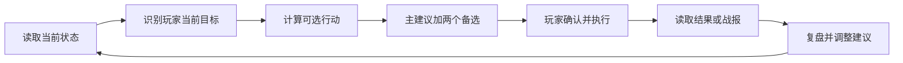

# 对话归档

- 会话 ID：`01a05bf6-8595-7d00-bdb5-9564627e2e0f`
- 开始时间：2026-09-01 15:54:37 CST
- 原工作目录：`/Users/yuanli/Documents/玩法知识库`
- 内容范围：仅保留用户与 Codex 的文字对话及用户附图；不包含平台系统/开发者指令、技能注入、工具调用和工具输出。

## 1. 用户

slg 游戏三谋，要做一个围绕着小白玩家，比较好用的ai 助手，
比如拿我自己的体验来说：
1.我刚进入 slg不知道选什么职业
2.在将池里面，选哪三个武将搭配，可以形成最适合的部队，去帮我征地垦地，获取更多资源
3.武将在城外，不知道这些地，是应该攻占，还是军屯，还是驻守，不明白怎么做能对我利益最大化
4.武将在城内垦地，有时候提示守军弱，我可以去征战，但还是打不过，受损，不知道问题在哪里
5.战报不知道如何看，如何分析
6.有几个部队后，不知道如何协调调度，比如同盟的任务选取哪个 部队之类的，如何对我来说利益最大化，不清楚
7.领取收益有几个入口，有军演、任务入口，还有活动入口，目前都是小红点提示，不能一次性都领取了
8.有个讨伐贼寇的任务卡了3天了，因为7点刷新的时候，我起不来，然后白天每次进去要不就没战斗，要不就人满了，导致我无法升级

以上是我零碎的体验，你从 slg 小白玩家入手，结合王者荣耀灵宝的体验，告诉我做一个什么样的 ai 助手，怎么一步步指导玩家，既不丧失游戏的乐趣，也能愉快的玩游戏，不至于迷茫不知道咋办

## 2. Codex

你这 8 个问题，表面上分别是职业、配将、土地、战报、同盟、领奖、限时任务，实际上指向的是同一个核心问题：

> **小白玩家不知道“我现在最应该做什么、为什么这么做、做错了怎么办”。**

所以，不建议先做一个“什么都能问的攻略机器人”，而应该做一个：

# **灵宝式的 SLG 新手副驾驶**

它不是替玩家玩游戏，而是陪玩家理解游戏、做选择、承担试错，并且在玩家不在线时帮他减少错过。

可以暂时叫它：**谋伴、谋宝、三谋小助手、军师灵宝**。

---

# 一、产品定位：不是百科，而是“现在该做什么”

普通攻略工具解决的是：

> “这个武将强不强？”

新手真正想知道的是：

> “我现在有这些武将、这些资源、这些地，今天只有 20 分钟，我应该先干什么？”

因此助手每次只需要给玩家 4 个答案：

1. **现在最值得做什么**
2. **为什么推荐这个**
3. **如果失败，问题可能在哪里**
4. **下一次什么时候回来比较合适**

核心体验可以抽象为：



真正的 AI 闭环不是“问一句答一句”，而是：

> **状态 → 目标 → 行动 → 结果 → 学习**

---

# 二、借鉴王者荣耀灵宝，但不要只学“可爱”

王者荣耀灵宝值得借鉴的，不只是养成和外观，而是它把一个功能做成了“常在身边的角色”：灵宝可以在大厅出现，通过想法气泡与玩家互动，局内陪伴还支持语音频率、音色、音量等设置，并且在队友语音交流时降低打扰。这个交互思路很适合转化成 SLG 的“陪伴式决策助手”。([bbs.4399.cn](https://bbs.4399.cn/thread-view-tid-46820920?utm_source=openai))

可以把产品拆成两层：

## 1. 灵宝层：陪伴与情绪

负责：

- 登录时欢迎玩家
- 记住玩家的游戏习惯
- 在关键时刻提醒
- 失败后降低挫败感
- 玩家完成目标时给予反馈
- 用轻松的语气告诉玩家“今天不用把所有事情做完”

例如：

> “今天只有 15 分钟，我帮你挑最划算的三件事。”  
> “这次不是你不会打，是这支队伍不适合拿这块地。”  
> “7 点的贼寇错过了，别急，我给你换一条今天还能完成的成长路线。”

## 2. 决策层：规则、计算与推荐

负责：

- 职业推荐
- 武将组合
- 土地决策
- 战报分析
- 同盟任务分配
- 奖励聚合
- 时间窗口提醒

这两层必须分开。

**不能因为 AI 说话可爱，就掩盖了推荐依据不充分。**

每条重要建议都应该有：

- 推荐理由
- 可能风险
- 数据依据
- 置信度
- 备选方案

---

# 三、最重要的交互原则：一主两备，而不是甩给玩家十个选项

小白最怕复杂。

每次不要给他一页攻略，而是给：

## 一个主建议

> “现在建议用队伍 1 攻占这块 4 级地。”

## 两个备选

> “如果你想稳一点，用队伍 2 先打低一级的地。”  
> “如果你想追求资源效率，可以先军屯，但会放弃这块地的战略位置。”

按钮最好固定为：

- **现在去做**
- **为什么**
- **换一个方案**
- **稍后提醒**

这样既降低选择压力，也保留玩家的主动权。

---

# 四、围绕你提出的 8 个问题，具体应该怎么做

## 1. 刚进入游戏，不知道选什么职业

### 不要做成“职业介绍页”

职业介绍页通常会告诉玩家：

- 这个职业有什么技能
- 这个职业有什么天赋
- 这个职业有什么加成

但小白看完还是不知道：

> “那我到底选哪个？”

### 助手应该先问 3 个简单问题

1. 你每天大概能玩多久？
2. 你更喜欢打仗、发育、建设，还是帮助同盟？
3. 你希望自己成为核心战斗玩家，还是轻松参与？

然后给出：

### “适合你的职业”

例如：

> **推荐：司仓**  
> 原因：你每天在线时间短，更适合稳定积累资源；司仓不要求你 7 点准时上线，也能通过后勤贡献获得价值。  
> 你暂时不适合选择镇军，因为镇军的价值更依赖高频战斗和实时调度。  
> 如果你以后喜欢参与攻城，可以再转向天工或镇军方向。

职业推荐要展示“代价”，而不是只说优点：

| 职业 | 你会得到什么 | 你会牺牲什么 | 适合谁 |
|---|---|---|---|
| 战斗型 | 更直接的战斗影响力 | 更依赖队伍与在线时间 | 喜欢频繁战斗 |
| 资源型 | 稳定发育、容错高 | 爆发战斗参与感较弱 | 时间少、偏发育 |
| 建设型 | 同盟任务中容易找到位置 | 个人战斗成长慢一些 | 喜欢建设和攻城 |
| 支援型 | 可帮助队友、低战也有价值 | 个人击杀感较少 | 喜欢协作 |

关键设计是：

> **职业选择要有方向感，但不能制造“选错就废了”的恐惧。**

可以设计“新手试用期”：

- 前 3 天允许低成本体验不同方向
- AI 告诉玩家：“你实际玩下来更偏向资源型”
- 第 4 天再建议正式确定职业

---

## 2. 将池里选哪三个武将搭配

这里最容易做错。

不要给玩家一个永久的“最强三将排行榜”，因为小白需要的是：

> **当前资源、当前目标、当前对手下，最适合我的三将。**

### 推荐结果至少分成三种

#### 稳妥队

- 低损耗
- 容错高
- 适合征地、开荒、第一次尝试

#### 效率队

- 资源消耗或时间效率更好
- 对操作和养成要求更高

#### 试错队

- 上限高
- 但失败风险更大
- 适合玩家主动探索

例如：

> **当前任务：征战城外 4 级地**  
>   
> 推荐队伍：A、B、C  
> 选择理由：  
> - A 负责主要输出  
> - B 负责承伤或控制  
> - C 与 A 的技能效果有配合  
> - 这支队伍对当前守军类型比较安全  
>   
> 不推荐队伍：D、E、F  
> 原因：虽然单武将评分更高，但技能目标冲突，且当前等级不足以发挥组合效果。

### 阵容推荐需要考虑的维度

- 武将等级
- 武将技能等级
- 可用兵力
- 兵种或类型克制
- 武将之间的技能联动
- 当前任务目标
- 敌方守军类型
- 玩家对损耗的接受程度
- 队伍培养成本
- 这支队伍后续还能不能承担同盟任务

AI 不应该只显示“推荐指数 92 分”，而要显示：

> “为什么适合你？”  
> “哪里会输？”  
> “下一级优先养谁？”

还可以设计成：

> “不用研究所有武将，今天先养这三个。等这支队伍达到某个阶段，再解锁第二支队伍。”

这样小白不会一开始就陷入整个将池。

---

## 3. 城外的地，到底是攻占、军屯还是驻守

这个问题非常适合 AI，因为玩家并不是不知道三个按钮，而是不知道三种行为的长期利益差异。

地图上可以直接给出三种颜色：

- **绿色：建议攻占**
- **蓝色：建议军屯**
- **黄色：建议驻守**
- **灰色：当前不建议处理**

### AI 判断逻辑

可以综合：

1. 玩家当前缺什么资源
2. 这块地的单位时间收益
3. 攻占成功概率
4. 可能产生的伤兵和时间损耗
5. 这块地是否是通路、跳板或同盟战略位置
6. 当前是否需要保留兵力
7. 玩家今天还能在线多久
8. 同盟是否有相关任务

核心不是“战力最高的玩家怎么做”，而是：

> **对这个玩家当前目标而言，哪种行动的边际收益最高。**

可以给出非常白话的结果：

> **建议：军屯**  
>   
> 你现在缺粮，且今天在线时间只有 20 分钟。  
> 攻占这块地预计需要 2 次尝试，成功后还要等待恢复；军屯虽然少了战略位置，但今天能立刻提供更多有效资源。  
>   
> 如果你的同盟今晚要打这条路线，则改为攻占。

或者：

> **建议：攻占**  
>   
> 这块地本身收益一般，但它是你去往同盟任务区域的通路。现在不占，后面要多花一次行军时间。  
>   
> 如果你只是想提升今天的资源，不建议现在打它。

这类解释会让玩家逐渐学会土地价值，而不是永远依赖 AI 点按钮。

---

## 4. 明明提示守军弱，却还是打不过

这是新手非常典型的挫败点。

玩家看到“守军弱”，会自然理解成：

> “我一定能赢。”

但“守军弱”不一定代表：

- 当前队伍一定克制
- 玩家兵力充足
- 武将等级足够
- 技能已经成型
- 队伍组合合理
- 战斗损耗可以接受

### AI 要做“战前体检”

点击征战前，先显示：

> **预计可以获胜，但不建议现在打。**

然后告诉玩家最可能的问题：

- 兵力不足
- 武将等级差距过大
- 技能没有升级
- 队伍定位冲突
- 类型克制不利
- 伤兵尚未恢复
- 当前队伍不适合连续作战
- “守军弱”只是相对于其他土地弱，不代表对你当前队伍安全

这里可以做一个**安全阈值**：

- 高概率胜利，低损耗：推荐
- 可能胜利，但损耗高：谨慎
- 理论能赢，但需要多次尝试：不推荐
- 高概率失败：拦截并解释

建议语气不要是：

> “禁止挑战。”

而是：

> “可以打，但这不是今天最划算的尝试。”  
> “如果你想试，我会帮你记录这次结果。”  
> “如果你想稳，我建议先完成这两个准备动作。”

### 失败以后不要只给结论，要给“下一次实验”

例如：

> 这次失败最可能不是因为守军太强，而是你的前排在第 2 回合就倒了。  
>   
> 下一次只改一个变量：  
> **先把 B 武将换成 C 武将。**  
>   
> 不建议同时换三个人，否则你不知道究竟是哪一个调整起作用。

这会把失败变成学习，而不是让玩家觉得自己“不会玩”。

---

## 5. 不知道如何看战报、如何分析

战报助手最好设计成三个层次。

## 第一层：一句话结论

> 你输了，主要原因不是伤害不够，而是前排过早倒下，导致后排技能没有完整释放。

## 第二层：三个关键原因

例如：

1. 第 1 回合承伤超过预期
2. 第 2 回合核心武将被控制
3. 你的输出技能没有覆盖到主要目标

## 第三层：下一步行动

> 建议先升级 B 的防御技能，再用同样队伍挑战一次。  
> 如果仍然失败，再更换 C。

战报分析可以固定成：

> **结果 → 原因 → 证据 → 改法 → 预计影响**

用户点开“为什么”后，再查看：

- 每回合发生了什么
- 哪个武将贡献最高
- 哪个武将没有发挥
- 伤害、承伤、治疗、控制情况
- 失败发生在哪个时间点
- 与上一场相比变化了什么

最重要的一点是：

> **不要把战报分析做成复杂的数据面板，要先翻译成玩家能行动的建议。**

复杂数据可以折叠，不能一上来全部展示。

---

## 6. 有几个部队后，不知道怎么调度

此时 AI 应该从“配将助手”升级成“个人调度员”。

建议把每支队伍赋予一个当前角色：

- 主力作战队
- 征地发育队
- 资源队
- 同盟支援队
- 预备队
- 恢复队

### 同盟任务不要按“谁战力最高”分配

应该考虑：

- 任务最低需求
- 截止时间
- 行军距离
- 队伍当前状态
- 完成任务后的个人收益
- 对同盟的贡献
- 是否需要保留一支机动队
- 玩家什么时候会离线

一个简单的分配原则是：

> **用“刚好够完成任务”的队伍去完成任务，把最强队留给真正需要它的场景。**

例如：

> 同盟现在有 3 个任务：  
>   
> - 任务 A：低难度运输，奖励一般  
> - 任务 B：中难度攻占，奖励高  
> - 任务 C：驻守通路，战略价值高  
>   
> 推荐：  
> - 队伍 3 → 任务 A  
> - 队伍 1 → 任务 B  
> - 队伍 2 → 任务 C  
>   
> 原因：队伍 1 是唯一能稳定完成任务 B 的队伍；队伍 3 足够完成运输，不需要占用主力。

助手还要告诉玩家：

> “现在不要让所有队伍同时出发，至少保留一支队伍应对突发情况。”

这比单纯告诉玩家“去做同盟任务”有价值得多。

---

## 7. 军演、任务、活动都有红点，不知道哪里能一次性领取

这是典型的**入口碎片化问题**，不应该让 AI 继续教育玩家去记入口，而应该直接做一个：

# **收益收件箱**

进入后自动分三类：

## 可以直接领取

- 没有选择成本
- 不会覆盖背包
- 没有领取顺序要求
- 没有即将过期风险

显示：

> “发现 12 个可安全领取奖励，预计耗时 10 秒。”

提供：

> **一键领取全部安全奖励**

## 需要玩家做选择

例如：

- 多个资源箱选一个
- 奖励涉及职业方向
- 奖励涉及队伍培养
- 领取后会改变当前策略

显示：

> “这里有 2 个奖励需要你选择。我建议选粮食，因为你当前主力队缺粮。”

## 即将过期

按照时间排序：

> “活动奖励还有 2 小时过期。”  
> “军演奖励可以等到今晚再领，不影响收益。”

红点不应该表示“有东西”，而应该表示：

> **“有一件值得你现在处理的事情。”**

这会显著降低新手的认知负担。

---

## 8. 讨伐贼寇因为 7 点起不来，卡了 3 天

这是最值得重点做的场景。

它不只是一个“提醒功能”，而是：

# **时间窗口适应系统**

玩家的问题不是不知道任务存在，而是：

- 刷新时间和作息冲突
- 白天进去时已经没战斗
- 人满以后无法完成
- 任务失败后没有替代成长路径
- 连续失败 3 天以后，玩家认为自己“被卡住了”

### AI 应该做 4 件事

## 第一，学习玩家作息

玩家可以简单设置：

- 工作时间
- 睡眠时间
- 通常上线时间
- 是否接受早晨提醒
- 哪些任务值得叫醒
- 哪些任务错过就直接放弃提醒

AI 不应该每天所有事情都提醒，而应该判断：

> “这个任务的价值是否值得打扰玩家？”

## 第二，提前做准备

如果游戏规则允许，可以提前：

- 标记任务
- 设置提醒
- 预先配置队伍
- 提前恢复兵力
- 提前留出行动次数
- 设置官方支持的预约或自动参与

但如果游戏不提供官方能力，就只做提醒和准备建议，不能模拟登录、自动抢位、自动点击等高风险操作。

## 第三，失败以后马上提供替代路线

用户错过贼寇之后，不能只说：

> “明天早起。”

应该说：

> “今天这个任务已经不适合继续等了。你还可以通过以下两件事获得接近的成长收益：  
> 1. 完成同盟运输任务  
> 2. 攻占一块低损耗土地  
>   
> 这样今天不会完全停滞。”

这是非常关键的设计：

> **任何关键成长任务都应该有“错过后的恢复路径”。**

## 第四，检测“连续卡住”

如果 AI 发现某个任务连续两天、三天没有完成，要主动改变策略：

> “你已经连续 3 天因为刷新时间错过贼寇，不建议再把它当成今天的主目标。我们改成白天可完成的任务，等下次刷新时再尝试。”

这不是纵容玩家放弃，而是避免游戏的成长感被一个时间点锁死。

---

# 五、助手的主界面应该长什么样

建议主界面不是攻略首页，而是：

## “今天的谋略”

### 顶部：灵宝式陪伴角色

> “主公，今天有 20 分钟，我们先完成最划算的三件事。”

### 第一张卡：现在最值得做

> **先用队伍 1 攻占 4 级粮地**  
> 预计收益：高  
> 失败风险：低  
> 原因：你当前最缺粮，而且这块地距离城池近  
>   
>   

### 第二张卡：队伍状态

> 队伍 2 正在恢复，预计 18 分钟后可再次出征。

### 第三张卡：同盟任务

> 同盟有 2 个任务适合你。  
> 推荐选择运输任务，不占用主力，且距离你当前城池较近。

### 第四张卡：收益收件箱

> 有 8 个奖励可安全领取，1 个奖励需要选择。

### 第五张卡：时间提醒

> 今天 19:30 有一个适合你的贼寇窗口。  
> 如果你不方便上线，我会在你下次上线时提供替代成长路线。

---

# 六、要有四种模式，而不是一个固定的 AI

不同玩家希望 AI 管得不一样。

## 1. 陪玩模式

适合纯小白：

- 只给一个推荐
- 用通俗话解释
- 主动提醒
- 不展示太多数字

## 2. 教练模式

适合正在学习的玩家：

- 展示两个备选方案
- 解释收益和风险
- 战后自动复盘
- 鼓励玩家先猜，再揭晓答案

例如：

> “你先猜一下，这块地应该攻占还是军屯？我等你选完再解释。”

## 3. 效率模式

适合已经熟悉系统的玩家：

- 批量领取
- 批量安排队伍
- 快速查看高价值任务
- 只提示异常和风险

## 4. 同盟模式

适合需要协作的玩家：

- 同盟任务推荐
- 个人可承担贡献
- 任务截止时间
- 需要保留的预备队
- 战前、战中、战后任务提醒

---

# 七、怎样保证“不丧失游戏乐趣”

这是这个产品成败的关键。

## 1. 不给唯一答案，给取舍

不要说：

> “只能这样玩。”

而要说：

> “如果你想稳，选 A；如果你想追求资源，选 B；如果你想尝试，选 C。”

SLG 的乐趣本来就来自决策，不要把所有决策都抹掉。

## 2. 让玩家逐渐学会，而不是永久依赖

新手前期：

> “你应该选司仓，因为……”

一段时间后变成：

> “你觉得自己更缺资源，还是更缺战斗机会？”

再往后变成：

> “我发现你最近一直优先发展资源，你要不要把默认推荐切换成资源优先？”

助手最终应该让玩家越来越会玩，而不是让玩家越来越不会脱离助手。

## 3. 保留探索模式

玩家可以选择：

- **稳妥推荐**
- **高效推荐**
- **探索推荐**

探索推荐故意不追求绝对最优，而是告诉玩家：

> “这套组合不是当前最稳，但能帮助你理解控制队的玩法。”

## 4. 失败不能被羞辱

不要说：

> “你的阵容错误。”

要说：

> “这次失败很有价值，我们已经知道问题集中在前排承伤。下一次只改一个变量。”

## 5. 控制打扰

灵宝可以常在，但不能一直说话。

建议提供：

- 安静模式
- 只提醒高价值事件
- 只提醒即将过期内容
- 只在进入地图、战报、同盟任务页面时说话
- 战斗中不弹复杂解释
- 队友语音或同盟战时降低频率

---

# 八、技术上不能只靠大语言模型

这是一个容易被低估的地方。

大语言模型适合：

- 理解玩家的问题
- 把复杂规则翻译成人话
- 解释战报
- 生成陪伴式表达
- 根据玩家情绪调整语气

但不适合单独负责：

- 判断哪块地收益最高
- 计算队伍胜率
- 判断技能是否冲突
- 分配同盟任务
- 处理限时事件
- 记忆版本变化

建议采用四层结构：

## 1. 游戏状态层

读取：

- 玩家等级
- 资源
- 武将
- 队伍
- 兵力
- 土地
- 行军状态
- 战报
- 任务
- 奖励
- 时间窗口

接入方式可以按优先级：

1. 官方接口或官方合作能力
2. 游戏内可导出的结构化数据
3. 战报截图识别
4. 玩家手动确认

如果当前无法完整读取状态，AI 必须明确说：

> “我目前只能根据你提供的战报截图判断，无法确认实际技能等级。”

## 2. 游戏规则与版本层

每个赛季、每个版本都要有自己的规则快照：

- 职业规则
- 武将技能
- 兵种关系
- 土地收益
- 任务刷新
- 奖励入口
- 同盟权限

并且要明确区分：

- **规则事实**
- **玩家常见做法**
- **AI 的设计推断**
- **尚未验证内容**

不能让模型把旧赛季攻略当成当前版本结论。

## 3. 决策引擎

将问题统一成：

```text
当前状态 + 玩家目标 + 可选动作 + 约束条件
→ 收益、风险、时间成本、机会成本
→ 推荐结果
```

比如土地决策不是简单判断：

```text
战力 > 守军战力 = 攻占
```

而应该判断：

```text
攻占收益
- 伤兵成本
- 行军时间
- 失败风险
- 占用主力的机会成本
+ 战略位置价值
+ 同盟任务价值
```

## 4. 解释与陪伴层

最后才由 AI 把结果转成玩家听得懂的话。

---

# 九、建议的落地顺序

不建议一开始就做“全自动 AI 指挥官”。建议按下面顺序迭代。

## 阶段 0：先建立小白任务地图

把新手前 7 天拆成可观察目标：

- 选择职业
- 组成第一支队伍
- 完成第一次征地
- 完成一次低损耗战斗
- 学会看一次战报
- 完成一次同盟任务
- 领取全部基础收益
- 完成一次限时讨伐或替代成长

每个目标都记录：

```text
玩家当前状态
玩家想达成的目标
可选动作
AI 建议
玩家是否采纳
实际结果
玩家反馈
```

## 阶段 1：先做“今天该做什么”

这是最有价值的 MVP。

包含：

- 当前状态摘要
- 今日 3 件最值得做的事
- 奖励聚合
- 行军和恢复提醒
- 玩家可用时间设置
- 每件事的理由

先让玩家感受到：

> “我一上线就知道该做什么了。”

## 阶段 2：做队伍和土地推荐

包含：

- 任务型配将
- 稳妥/效率/探索三种方案
- 土地攻占、军屯、驻守建议
- 失败风险预警
- 队伍培养优先级

## 阶段 3：做战报教练

包含：

- 自动总结战报
- 失败原因排序
- 下一次只改变一个变量
- 对比两场战斗
- 记录玩家常见错误

## 阶段 4：做个人调度和同盟任务

包含：

- 多队伍分工
- 同盟任务推荐
- 任务截止时间
- 预备队保留
- 个人贡献记录
- 异步贡献路线

## 阶段 5：做灵宝式陪伴和主动提醒

包含：

- 角色个性
- 语音或文字陪伴
- 关键节点鼓励
- 作息识别
- 任务错过后的恢复路线
- 新手引导逐步减少

---

# 十、真正的产品壁垒是什么

“会聊天”“会写攻略”很容易被复制。

真正有价值的是：

## 1. 游戏语义层

能理解：

- 这个职业在同盟里有什么价值
- 这块地为什么现在不该打
- 这次战报暴露的是队伍问题还是资源问题
- 哪个同盟任务适合当前玩家

## 2. 决策反馈数据

持续积累：

> **状态 → 建议 → 玩家是否采纳 → 实际结果 → 玩家评价**

这比单纯积累聊天记录更有价值。

## 3. 战斗模拟与校准

推荐不只是“看起来合理”，还要经过真实战报验证：

- 预测是否成功
- 预计损耗和实际损耗差多少
- 哪类玩家容易被误导
- 哪种推荐在不同版本失效

## 4. 同盟工作流

如果助手能进入：

- 同盟任务
- 攻城集结
- 运输
- 贡献分配
- 战后复盘

它就不只是个人工具，而是同盟基础设施。

## 5. 跨游戏适配能力

未来可以抽象为：

```text
通用决策中枢
+ 三国谋定天下适配层
+ 具体同盟组织适配层
```

换一款 SLG 时，不能直接复用某个武将答案，但可以复用：

- 状态—动作—结果模型
- 新手任务模型
- 推荐与复盘框架
- 时间调度框架
- 评测体系
- 权限和同盟工作流

---

# 十一、最终建议：先做“新手成长管家”，再做“AI 指挥官”

我建议你的第一版产品定义为：

> **一个会观察玩家状态、每天给出少量高价值行动、解释原因、分析失败、整合收益，并适应玩家作息的三谋新手成长管家。**

它每天只做几件事：

1. 告诉玩家今天最重要的三件事
2. 帮玩家选一支适合当前目标的队伍
3. 告诉玩家当前土地应该攻占、军屯还是驻守
4. 在出征前预警高风险
5. 战后用一句话解释输赢
6. 自动归拢可以领取的收益
7. 同盟任务中告诉玩家哪一个最适合自己
8. 错过限时任务后，给出替代成长路线

产品最核心的一句话可以是：

> **“我不替你玩三谋，但我保证你每次上线都知道下一步，而且知道为什么。”**

这比单纯的配将器、攻略库或聊天机器人更适合小白，也更有机会成长为真正的 SLG AI 决策助手。

<oai-mem-citation>
<citation_entries>
MEMORY.md:59-90|note=[SLG AI productization, state-action-result loop, staged rollout, data moat, and evidence boundaries]
</citation_entries>
<rollout_ids>
019c6e27-e55b-73d1-87d8-4e01f1f75043
</rollout_ids>
</oai-mem-citation>

## 3. 用户

针对你上面提到的每个场景，你帮我基于三谋的界面，形成一个 html，是可以跟小助手交互的

## 4. Codex

我会把它做成一个可直接打开的单文件交互原型：以“三谋”的主城、地图、部队、战报、同盟、收益入口为骨架，再加上灵宝式的小助手浮层，让你可以实际点击体验 8 个新手场景。

## 5. Codex

已完成一个可直接打开的单文件 HTML 原型：

**文件：**  
`/Users/yuanli/Documents/玩法知识库/三谋新手助手_灵宝式交互原型.html`

这个原型已经包含：

- 三谋风格的主城、天下图、部队、战报、同盟、收益入口
- 灵宝式右侧“小助手谋伴”常驻面板
- 陪玩模式 / 教练模式切换
- 新手职业选择流程
- 三将阵容推荐：稳妥 / 效率 / 探索
- 土地决策：攻占 / 军屯 / 驻守 / 稍后处理
- “守军弱但打不过”的战报诊断
- 多部队与同盟任务调度
- 军演、任务、活动收益聚合
- 一键领取安全奖励
- 活动选择宝箱的资源推荐
- 贼寇 7 点刷新错过后的替代成长路线
- 时间管家与作息提醒设置
- 可直接输入问题与谋伴对话，例如：
  - `职业怎么选？`
  - `我的武将怎么搭配？`
  - `为什么打不过？`
  - `这块地应该怎么办？`
  - `同盟任务选哪个？`
  - `贼寇错过了怎么办？`

我还做了以下检查：

- HTML 结构解析通过
- 内嵌 JavaScript 语法检查通过
- 主要页面和交互入口均已检查
- 不依赖外部图片、框架或第三方组件，打开文件即可运行

当前浏览器环境的本地地址访问被安全策略拦截，所以没有完成浏览器内的实际点击回归；不过文件本身和交互逻辑已经完成静态验证。

## 6. Codex

# 任务交接摘要

## 当前进展

已在工作区创建单文件交互原型：

`/Users/yuanli/Documents/玩法知识库/三谋新手助手_灵宝式交互原型.html`

原型定位为：

> **“灵宝式三谋新手副驾驶”**  
> 不替玩家自动玩，而是根据当前状态给出下一步、解释原因、分析失败，并提供错过后的恢复路线。

## 已完成的页面与交互

HTML 内含完整 CSS 和 JavaScript，不依赖外部框架、图片或组件。

主要页面：

- 主城
- 天下图
- 部队配置
- 战报教练
- 同盟调度
- 收益收件箱
- 时间管家

已实现的交互：

1. 职业选择  
   - 司仓、天工、镇军、奇佐
   - 支持“先体验一天”和确认职业方向

2. 三将阵容推荐  
   - 稳妥征地队
   - 效率资源队
   - 探索试错队
   - 可点击派出征地、查看风险、加入试验记录

3. 土地决策  
   - 攻占
   - 军屯
   - 驻守
   - 稍后处理
   - 弹窗解释资源、损耗、行军、同盟路线等综合依据

4. 战报分析  
   - “惜败”结果展示
   - 前排承伤不足诊断
   - 下一次只修改一个变量
   - 复试方案

5. 多部队和同盟任务  
   - 队伍分工
   - 辎重运输、驻守、攻城任务
   - 按任务需求、队伍状态和个人收益进行推荐

6. 收益聚合  
   - 军演、同盟、活跃、城建、征地等奖励统一展示
   - 一键领取安全奖励
   - 活动选择宝箱单独解释推荐资源
   - 红点数量和领取状态会动态变化

7. 时间管家  
   - 07:00 贼寇刷新错过状态
   - 白天替代成长路线
   - 19:30 下一次机会窗口
   - 睡前收益清理
   - 作息与提醒设置弹窗

8. 右侧谋伴助手  
   - 陪玩 / 教练模式切换
   - 当前建议卡片
   - 对话输入框
   - 关键词式本地回复：
     - 职业
     - 武将
     - 土地
     - 战报
     - 同盟
     - 领取
     - 贼寇
     - 在线时间

## 已采用的关键产品决策

- 不做单纯攻略百科或问答机器人
- 每次给“一主两备”：
  - 一个主推荐
  - 两个备选方案
- 推荐必须解释：
  - 为什么
  - 代价
  - 风险
  - 下一步
- 失败后提供恢复路线，而不是只告诉玩家“明天继续”
- 允许稳妥、效率、探索三种玩法
- 不做自动登录、自动抢任务、自动点击等可能违规的操作
- 陪伴角色常驻，但支持低打扰和教练模式
- 具体游戏数值未来需要接入当前赛季/版本规则，不能由大语言模型凭空猜测

## 已参考的工作区资料

- `/Users/yuanli/Documents/玩法知识库/SLG社会结构研究/00_知识库使用说明.md`
- `/Users/yuanli/Documents/玩法知识库/SLG社会结构研究/02_三国谋定天下/社会结构详解.md`
- `/Users/yuanli/Documents/玩法知识库/SLG社会结构研究/11_策划分类知识库/05_玩家分工、职业与低战价值.md`
- `/Users/yuanli/Documents/玩法知识库/SLG社会结构研究/11_策划分类知识库/04_战役节奏、时间窗口与行动工具.md`

这些资料强调要区分规则事实、玩家观察、设计推断和待验证内容；当前 HTML 是产品概念原型，不是当前游戏规则的实测工具。

## 已完成的验证

已完成：

- HTML 结构解析通过
- 内嵌 JavaScript 语法检查通过
- 页面和主要交互钩子存在性检查通过
- 本地预览服务器通过 `curl` 返回 200

未完成：

- 浏览器内实际点击回归测试

原因是当前浏览器安全策略拒绝访问本地地址和 `file://` 文件。已停止本地预览服务器，没有把浏览器端点击验证冒充为完成。

## 需要后续改进的地方

### 1. 时间管家页面目前没有主导航入口

`screen-schedule` 已存在，但左侧导航没有“时间管家”入口，目前只能通过设置弹窗进入相关设置。

后续建议：

- 在左侧导航增加“时间”或“提醒”入口；或
- 在主城“主城状态”区域增加“打开时间管家”按钮。

### 2. 当前是桌面端原型

CSS 设置了：

```css
body {
  min-width: 1080px;
}
```

目前更适合桌面展示，尚未真正适配手机端。

### 3. AI 回复目前是本地规则式演示

当前对话是根据关键词返回预设答案，适合展示交互概念。后续若要接入真实 AI，需要增加：

- 游戏状态读取
- 当前赛季规则库
- 武将和技能数据
- 土地收益计算
- 战报结构化解析
- 状态—建议—执行—结果反馈闭环

### 4. 可进一步加入真实“三谋”视觉素材

当前采用了自绘的深蓝、青绿色、金色界面风格，以及抽象主城和地图，避免外部资源依赖。后续如果用户提供官方截图或指定视觉参考，可以进一步做：

- 真实界面结构对齐
- 更准确的按钮位置和信息层级
- 武将头像与技能图标
- 地图贴图
- 战报样式
- 移动端界面

## 下一步建议

优先做这三件事：

1. 给“时间管家”增加显式导航入口
2. 根据用户实际点击反馈调整页面布局和文案
3. 如果用户认可交互方向，再继续做第二版：
   - 接入真实战报截图
   - 增加武将筛选和阵容对比
   - 增加地图地块选择状态
   - 增加“今天只玩 15 分钟 / 30 分钟 / 1 小时”的个性化计划生成

## 7. 用户

帮我形成 txt，到本地
